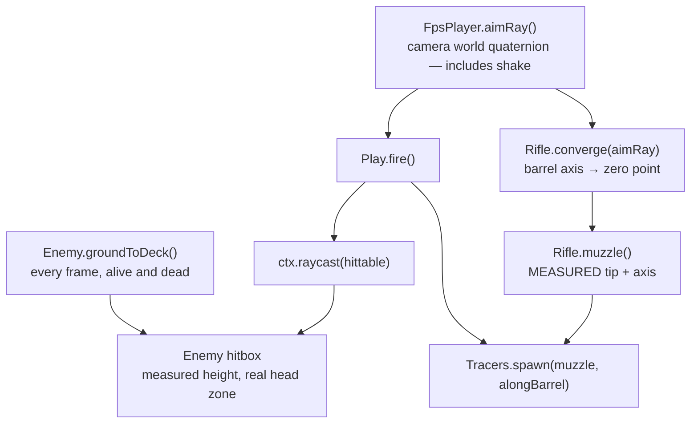

# PRD: Shot alignment, enemy grounding, and death settle

**Date:** 2026-08-18
**Author:** QA pass over `fps-framework` (live-instrumented, not code-reading alone)
**Status:** Proposed

**Complexity: 7 → HIGH mode** (10+ files `+3`, complex animation/state logic `+2`, new
aim-convergence module `+2`). Mandatory checkpoint after every phase.

---

## 1. Context

**Problem:** The rifle does not point where the round goes, the enemy never touches the
deck, and the death sequence snaps a leg three seconds after the body has stopped moving.

**How this was measured.** A Playwright probe drove the real WebGPU build at
`http://127.0.0.1:5183`, sampled `Object3D` world transforms, bone world positions, and
screen projections while the game ran, then killed the enemy through the real
`Enemy.hurt()` path and sampled the settle at 200 ms intervals. Every number below is
observed, not inferred. Probe scripts: `qa-probe1.mjs`, `qa-probe2.mjs` (see §9).

**Files analysed:** `src/scenes/Play.ts`, `src/entities/Rifle.ts`, `src/entities/Enemy.ts`,
`src/entities/FpsPlayer.ts`, `src/entities/Target.ts`, `src/render/tracers.ts`,
`src/render/range.ts`, `src/render/materials.ts`, `src/render/lighting.ts`,
`src/ui/Hud.tsx`, `src/game.ts`, `src/state.ts`, `playtests/*.json`, `package.json`.

**Baseline health:** `pnpm typecheck` clean. No console errors or page errors during a
full probe run. The bugs below are all silent — every existing gate passes on them.

### Measured evidence

| Measurement | Observed | Expected |
|---|---|---|
| Viewmodel barrel axis vs camera forward, hip fire | **7.09°** | ≈0° at the zero distance |
| Tracer direction vs barrel axis at 8 m | **7.46°** | <1° |
| Muzzle marker on screen, hip fire | **(0.516, 0.657)** | wherever the model's barrel actually ends |
| Muzzle marker in camera space, z | **−1.07 m** | −1.24 m (viewmodel geometry ends there) |
| ADS: barrel axis vs camera forward | 0.00° ✅ | 0° |
| ADS: muzzle screen x | **0.241** (0.19 m left of the eye axis) | ≈0.5 — the optic must sit on the camera axis |
| Enemy head-top world Y | **2.677 m** | 1.78 m (player eye is 1.66 m) |
| Enemy hitbox vertical span | **0 → 1.8 m** | full body |
| Lowest toe above the deck, walking | **0.024 – 0.228 m**, never 0 | 0 on the planted foot |
| Enemy `group.position.y` during death | 0 → **−1.15 m** over 2.2 s | grounded, monotonic |
| Leg correction timing | one instantaneous rotation at **t = 3.3 s** | continuous, invisible |

### Scene-wide metric audit

Nothing in this scene is authored against a stated unit, so the errors compound. Measured
world-space sizes against the real object each one depicts:

| Object | Measured | Real-world | Error |
|---|---|---|---|
| Player collider | 1.66 m tall, 0.68 wide | 1.78 m, 0.50 wide | eye sits at scalp height; body 36% too wide |
| **Enemy soldier** | **2.678 m** tall, hips at 1.51 m | 1.78 m, hips 0.95 m | **1.50×** |
| Enemy AK (rendered) | **1.19 m** long | 0.88 m | **1.35×** |
| **Player viewmodel rifle** | **1.425 m** long | 0.88 m | **1.62×** — and `Rifle.ts:74-79` claims it is normalised to 0.9 m |
| Target plates | up to **1.6 × 2.05 m** | IPSC 0.45 × 0.75; man-size 0.5 × 1.8 | **2–3×** wide; the tallest plate is taller than a person |
| Lockers | 1.5 × **2.5** × 0.95 m | 1.8 m tall | 1.4× |
| Concrete barricades | 4.15 × 1.5 × **1.5 m deep** | jersey barrier 0.6 m deep, 1.0 m tall | 2.5× deep |
| Muzzle-flash quad | **0.72 m** | 0.2–0.3 m | 2.4–3.6× |
| Yard, walls, drum, rail height | 35.2 m yard, 5.5 m wall, 0.99 m rail | — | ✅ correct |
| Impact puff, smoke, tracer width | 0.26 m / 0.22 m / 24 mm | — | ✅ acceptable for readability |

The enemy and both rifles are the visible failures: a 2.68 m soldier holding a 1.19 m AK
next to a 1.66 m player holding a 1.43 m rifle. **No part of this is intentional** —
confirmed with the user.

### Current behaviour

- Hitscan originates at the eye and runs along `player.forward`; the tracer is drawn from
  the viewmodel muzzle to that ray's endpoint, so the visible trail and the visible barrel
  disagree by 7.5° at close range.
- The viewmodel is attached with a single `fit.rotation.y = Math.PI` and no measurement,
  despite the comment at `Rifle.ts:74-79` claiming it is measured and normalised to 0.9 m
  (its actual camera-space extent is 0.70 × 0.39 × 1.43 m).
- The enemy's Y is pinned to `0` from `ROUTE[0]` and only ever ground-corrected while dead.
- `Enemy.#lowerLegToGround` fires once, 3.3 s after death, as an instantaneous quaternion
  premultiply on both `UpLeg` bones.

---

## 2. Bug inventory

Ranked. Each row cites the site to change.

### P0 — the reported defects

| # | Bug | Site | Effect |
|---|---|---|---|
| B1 | Tracer is drawn from the muzzle to the *eye ray's* endpoint, so it leaves the barrel at 7.5° | `Play.ts:222-227`, `tracers.ts:58-80` | "Shot direction doesn't match rifle alignment" |
| B2 | The muzzle marker is a hand-typed local offset `(-0.14, 0.16, -0.92)` that sits 0.17 m *inside* the barrel and off its axis | `Rifle.ts:100` | Flash, smoke, and tracer originate from the handguard |
| B3 | Hip pose applies `yaw: 0.12` (6.9°) to the whole weapon with no convergence, so the barrel permanently points left of the point of impact | `Rifle.ts:31`, `Rifle.ts:239-243` | The 7.09° above |
| B4 | ADS puts the weapon 0.19 m left of the eye axis while the HUD hides the crosshair | `Rifle.ts:35`, `Hud.tsx:71-80` | Down the sights there is no usable aim reference at all |
| B5 | Enemy never ground-snaps while alive — the planted foot floats 2.4 to 22.8 cm | `Enemy.ts:144`, `Enemy.ts:515`, `Enemy.ts:602-616` | "Enemy is kind of floating / not snapped to the ground" |
| B6 | One-shot leg IK at `DEATH_SETTLE_SECONDS` | `Enemy.ts:609-614`, `Enemy.ts:710-729` | "The leg suddenly snaps" |

### P1 — silent gameplay corruption found during the audit

| # | Bug | Site | Effect |
|---|---|---|---|
| B7 | The enemy renders 2.68 m tall (head-top) while `BODY_HEIGHT = 1.8` drives the hitbox and the damage zones | `Enemy.ts:24`, `Enemy.ts:154-160` | The head and shoulders are **outside the hitbox** — headshots are unhittable, and `HEAD_FRACTION 0.88` (`Play.ts:32`) maps to y≈1.58 m, i.e. the *navel* of a 2.68 m model. The 4× multiplier is awarded for belly shots. |
| B8 | Shots use `player.forward` (yaw/pitch only) while the camera adds hit-shake in `syncCamera` | `FpsPlayer.ts:84-91` vs `FpsPlayer.ts:101-113` | While taking fire, rounds go up to ~2.9° away from the crosshair |
| B9 | The enemy's tracer always terminates at the player's eye, including on rounds the accuracy roll missed | `Play.ts:330`, `Enemy.ts:783-785` | Every incoming round reads as a hit; the miss feedback is a lie |
| B10 | Nav treats anything with `box.max[1] > 0.5` as ground-blocking, including the raised walkway deck 3.3 m overhead | `Enemy.ts:322-335`, `range.ts:194-201` | A ~9 × 6 m region of the yard is unreachable for no visible reason |
| B11 | `#alignWeaponToHands()` keeps swinging the rifle at the left hand throughout the death clip | `Enemy.ts:607`, `Enemy.ts:285-300` | The weapon flails while the body falls |
| B12 | Wall-mounted plates (`standing: false`, y up to 4.6 m) drop by `-restY` on a hit | `Target.ts:91`, `range.ts:53-65` | A plate bolted to a wall falls 4.5 m to the deck and flies back up |

### P1 — scale and level integrity (found by the metric audit)

| # | Bug | Site | Effect |
|---|---|---|---|
| B18 | The enemy renders at **1.50×** human scale; the AK in its hand at **1.35×** | `Enemy.ts:141` (no normalisation), `Enemy.ts:44` `RIFLE_LENGTH = 1.25` | A giant soldier with a giant rifle stands beside a correctly-scaled player |
| B19 | The player viewmodel is **1.425 m** long and never normalised, despite the comment saying it is | `Rifle.ts:74-80` | The weapon eats the right half of the frame |
| B20 | **The ramp has no collider.** `range.ts:206-212` builds it with `new Mesh` and pushes it to `hittable` only | `range.ts:206-212` | The raised walkway is unreachable — the player falls through the only route up |
| B21 | Even if it were solid, the ramp's top ends at y ≈ 3.29 against a 3.68 m deck — a 0.39 m step against a 0.45 m autostep limit | `range.ts:193-211`, `FpsPlayer.ts:68` | Marginal, jarring transition |
| B22 | The open drum barrier (a 1.7π shell) is collided as a **solid 7.4 × 7.4 m box** | `range.ts:182` | The player is blocked by air inside a barrier they can see through |
| B23 | Three target plates (`standing: false` at y 2.68 / 3.65 / 4.6) hang in open space with no wall or mount behind them | `range.ts:39-65` | Plates float in mid-air; visible in every screenshot |
| B24 | Target plates are 2–3× a real silhouette; the 1.6 × 2.05 m plate is bigger than the soldier should be | `range.ts:38-72` | Distance reads wrong; a 30 m shot feels like a 10 m shot |
| B25 | The player capsule is 1.66 m tall and 0.68 m wide — the eye sits at scalp height on a body 36% too wide | `FpsPlayer.ts:9`, `FpsPlayer.ts:17-19` | Fails the audit at 0.93×; the player is shorter than the soldier should be and wider than a door frame expects |
| B26 | The muzzle-flash quads are 0.72 m across | `Play.ts:270`, `Rifle.ts:90-99` | 2.4× a real flame; a flash the size of a car door reads as a scale cue in every screenshot |
| B27 | 38 meshes built inside `Target.ts` (posts, brace, foot, frame) carry no name | `Target.ts:43-72` | Invisible to `pnpm scale` — reported as `unlabelled`, so their size is never checked |
| B28 | The enemy has no physics body at all — only a raycast proxy | `Enemy.ts:154-160`, `Play.ts:139-146` | The soldier and the player walk through each other |

### Coverage — every bug is assigned to a phase

Nothing found in this audit is left unfixed. A blank cell here is a defect in the plan, not
a judgement call, and the acceptance gate in §7 checks it.

| Phase | Closes |
|---|---|
| 0 ✅ | the measuring instrument itself — no bug, but every scale row below is gated by it |
| 1 | B1, B2, and the false measurement comment half of B17 |
| 2 | B3, B8 |
| 3 | B4 |
| 4 | B18, B19, B24, B25, B26 (the viewmodel flash cone), and the "normalised to 0.9 m" half of B17 |
| 5 | B5 |
| 6 | B6, B11, B13 |
| 7 | B7 |
| 8 | B12, B20, B21, B22, B23, B27 |
| 9 | B9, B10, B14, B15, B16, B26 (the enemy flash quad in `Play.ts`), B28 |

**28 bugs, 9 phases, zero unassigned.**

### P2 — polish and hygiene

| # | Bug | Site |
|---|---|---|
| B13 | Respawn teleports a fresh soldier to `ROUTE[0]` with no fade; the corpse disappears mid-frame | `Enemy.ts:567`, `Enemy.ts:575-600` |
| B14 | `Play.fire()` reads `muzzleWorld()` *before* `rifle.update()` runs that frame | `Play.ts:389` vs `Play.ts:392` |
| B15 | The 12-target goal is duplicated as a literal in the HUD | `Play.ts:28` vs `Hud.tsx:58` |
| B16 | `range.targets` are never registered with `ctx.entities`, so no scenario can assert on a plate | `Play.ts:96-97` |
| B17 | Comments at `Rifle.ts:74-79` and `Rifle.ts:32-35` describe measurements the code does not perform | `Rifle.ts:74-79`, `Rifle.ts:32-35` |

---

## 3. Solution

**Approach**

- Stop hand-typing weapon geometry. Measure the viewmodel's barrel tip and axis from the
  loaded mesh at construction, exactly as `Enemy.#equip` already measures the AK's
  `Grip_Bone` — the pattern exists in this repo, reuse it.
- Give the weapon a **zeroing solver**: the viewmodel's barrel axis converges on the aim
  ray at a fixed zero distance, so the barrel visibly points at the crosshair while the
  hip pose keeps its cant. The tracer then leaves along the barrel by construction.
- Make the camera basis the single source of aim truth. `player.forward` becomes a
  derivative of the camera's world quaternion so shake, FOV, and hitscan can never diverge.
- Ground the enemy every frame from the same skinned-bounds measurement the death path
  already uses, and make the death settle a continuous damp rather than a one-shot rotate.
- Derive the hitbox and damage zones from the measured model, deleting `BODY_HEIGHT`.



**Key decisions**

- [ ] Zero distance: **25 m**. Inside the yard's 34 m and beyond the 13 m engage range.
- [ ] Keep hitscan at the eye (standard FPS contract — the player shoots what the crosshair
      covers). The convergence solves the *visual* mismatch; it does not move the bullet.
- [ ] **One metre is one metre.** Every asset is normalised to its real-world size at load,
      from a single declared table — never a per-call-site literal. Decided with the user:
      nothing currently oversized is intentional.
- [ ] Enemy normalised to a **1.78 m** head-top; **the hitbox is derived from the measured
      model**, never from a constant. `BODY_HEIGHT` is deleted rather than retuned, so the
      two can never drift again.
- [ ] Reuse `measureThreePose` from `@threenative/playtest/three`; it is already the death
      path's measurement and is skinning-aware. Do not hand-roll a `Box3`.
- [ ] Ship a **standing scale harness** (Phase 0) so a mismatch is caught by a command
      instead of by eye. It is the measuring instrument every later phase asserts with.

**Data changes:** `GameState` unchanged. `Enemy.debug()` gains `footClearance`,
`modelHeight`, `headZoneMinY`; `Rifle` gains a `debug()` with `barrelAxisErrorDeg` and
`muzzleLocal` so scenarios can assert on aim rather than on pixels.

---

## 4. Integration Ledger

| # | New thing | Live caller (`file:line`, non-test) | Replaces | Old path removed? | Negative control |
|---|---|---|---|---|---|
| 1 | `Rifle.#measureBarrel()` | `Rifle.ts` constructor — TBD | hardcoded `flash.position.set(-0.14,0.16,-0.92)` `Rifle.ts:100` | deleted in Phase 1 | forcing the measured tip to the old literal re-opens the 0.17 m gap and reddens `aim-alignment` |
| 2 | `Rifle.converge(origin, direction)` | `Play.ts:392` `rifle.update(...)` — TBD | none (new) | n/a | disabling convergence pushes `barrelAxisErrorDeg` back over 7° |
| 3 | `Rifle.barrelRay()` | `Play.ts:227` tracer spawn — TBD | `muzzleWorld()` + eye-ray endpoint | `muzzleWorld()` deleted in Phase 1 | spawning from the eye instead reddens `tracer-follows-barrel` |
| 4 | `FpsPlayer.aimRay()` | `Play.ts:211-212` and `FpsPlayer.syncCamera` — TBD | `get forward()` | deleted in Phase 2 | applying shake with the old getter reddens `shot-tracks-crosshair` |
| 5 | `Enemy.#groundToDeck()` | `Enemy.ts` `update()` both branches — TBD | `#groundDeathPose()` (death-only) | folded into the new method, Phase 3 | pinning `group.y = 0` reddens `enemy-foot-contact` |
| 6 | `Enemy.#settleDeath(dt)` | `Enemy.ts` dead branch — TBD | `#lowerLegToGround` one-shot | converted to a damped target, Phase 4 | restoring the one-shot reddens `death-no-snap` (frame-to-frame ankle delta) |
| 7 | measured `Enemy.#modelHeight` | hitbox construction + `Play.ts:246-247` zones — TBD | `BODY_HEIGHT = 1.8` `Enemy.ts:24` | constant deleted, Phase 5 | a head-height ray missing the hitbox reddens `headshot-hits-head` |
| 8 | `playtests/aim-alignment.playtest.json` + 3 more | `package.json` `test` script — TBD | n/a | n/a | each is run once against `HEAD~` and must fail there |
| 9 | `tools/scale-audit.mjs` | `package.json:9` (`scale`), `package.json:18` (`test`, last gate) | ad-hoc root probes `measure.mjs`, `shape.mjs`, `closeup.mjs`, `grip-sweep.mjs` | still present — folded in when Phase 4 lands | ✅ observed: setting `humanHeight` to 2.678 turns the enemy row green |
| 10 | `src/render/scale.ts:12` `scale`, `:68` `SCALE_EXPECTATIONS` | `tools/scale-audit.mjs:118` imports both | `RIFLE_LENGTH = 1.25`, plate literals in `TARGETS`, `BODY_HEIGHT = 1.8` | **still live — Phases 4 and 7 delete them** | ✅ observed: editing the table moves the verdict |
| 11 | `normaliseHeight` / `normaliseLongestAxis` | `Enemy.ts` + `Rifle.ts` constructors — **Phase 4, not yet written** | nothing (the normalisation was only ever a comment) | n/a | skipping the call reddens `pnpm scale` on 4 rows |
| 12 | `Enemy.modelHeight` (bone-accurate) | `Enemy.ts:872` in `debug()`; `tools/scale-audit.mjs:141` | `Box3` over a skinned mesh, which reports the bind pose | n/a — the bind-box path was never a public API | ✅ observed: renaming the crown bone pattern drops the row to `not measurable`, a FAIL |

### Reachability

**How is this reached?** Frame loop. `Play.enter()`'s returned frame function already calls
`rifle.update`, `player.update`, and `enemy.update` every tick (`Play.ts:388-395`). Every
new method hangs off those three calls — there is no new entry point to register.

**User-facing?** YES, entirely visual. Manual checkpoint required on every phase.

**Full flow:** player pulls the trigger → `Play.ts:389` `fire()` → aim ray from the camera
basis → hitscan + `rifle.barrelRay()` → tracer leaves the measured muzzle along the barrel
→ visible in the frame, and assertable via `rifle.debug().barrelAxisErrorDeg`.

**Replaces:** `Rifle.muzzleWorld`, `Rifle.#flash.position` literal, `FpsPlayer.forward`,
`Enemy.#groundDeathPose`, `Enemy.#lowerLegToGround` one-shot, `Enemy.BODY_HEIGHT`. All
deleted or reduced to delegation inside the phase that supersedes them.

---

## 5. Execution phases

Every phase edits pre-existing files (there are no greenfield files in this plan except
playtest scenarios). Every phase ships one thing a player can see.

---

#### Phase 0: The scale harness — a mismatch becomes a failing command ✅ DONE 2026-08-18

**Why first:** every later phase asserts a size. Building the instrument first means the
scale bugs are caught by `pnpm scale` rather than by squinting at a screenshot, and it is
the one artifact that keeps catching them after this PRD is closed.

**Files (max 5)**

- `tools/scale-audit.mjs` — NEW: drives the real WebGPU build, walks the scene graph, and
  prints a metric table of every named object, effect sprite, and character.
- `src/render/scale.ts` — NEW: the single declared table of real-world sizes
  (`HUMAN_HEIGHT = 1.78`, `RIFLE_LENGTH = 0.88`, `SILHOUETTE = {w: 0.5, h: 1.8}`, …) with
  tolerance bands. Imported by the entities in later phases, read by the audit.
- `package.json` — EDIT: `"scale": "node tools/scale-audit.mjs"`, and add it to `test`.
- `src/entities/Enemy.ts` — EDIT: `debug()` exposes `modelHeight` so the audit reads a
  bone-accurate figure rather than a bind-pose box.
- `src/render/range.ts` — EDIT: name the prop meshes (`locker`, `barricade`, `ramp`, …) so
  the audit can label what it measured.

**Implementation**

- [x] The audit measures **bone-accurate** heights for skinned characters (`Enemy.modelHeight`,
      off the crown bone) and world `Box3` for everything else — a bind-pose box on a skinned
      mesh is what hid this class of bug in the first place.
- [x] Each row is compared against `scale.ts`'s declared band and prints
      `FAIL enemy soldier 2.677 m expected 1.67–1.89 m (1.5×)`; exits non-zero.
- [x] `--report` writes `screenshots/scale-audit.json` so a diff between runs is reviewable.
- [x] `--ruler` walks the subject in front of the camera, stands a 1.78 m striped pole beside
      it, and screenshots — `screenshots/scale-ruler.png`. The pole reaches the soldier's
      **waist**, which is the whole argument in one image.
- [x] **Added during the build, not in the original plan:** a `match` check kind. The first
      run *passed* the enemy hitbox — 1.8 m sits comfortably inside the human band — while the
      body it wraps measured 2.677 m. An absolute band cannot see that; only the relationship
      can. `enemy-hitbox` is now checked against the measured `enemy`, and fails at 0.67×.
      This is the check that enforces "the hitbox should match the enemy size".

**Wiring**

- [x] Caller edited: `package.json:9` adds `scale`; `package.json:18` runs it as the **last**
      gate in `test`. Deliberately last, not first: the baseline is red until Phase 4, and a
      known-red gate in front would hide a scenario regression during Phases 1–3.
- [x] Registration: none needed — it starts its own Vite server and drives the real build,
      the same way `pose-probe.mjs` does. `pnpm scale` is the whole interface.
- [x] Old path: the ad-hoc root probes are superseded but **not yet deleted** — they are
      folded in when Phase 4 stops needing them as a cross-check. Recorded as open.
- [x] Ledger rows filled: #9, #10, #12. (#11 belongs to Phase 4.)

**Tests**

**Red baseline recorded 2026-08-18 — `12/34 checks pass, 22 FAIL`:**

| Subject | Measured | Expected | Ratio |
|---|---|---|---|
| enemy soldier (bone-accurate) | 2.677 m | 1.67–1.89 m | **1.50×** |
| player viewmodel rifle | 1.425 m | 0.75–1.01 m | **1.62×** |
| enemy AK (rendered) | 1.164 m | 0.77–0.99 m | **1.32×** |
| enemy hitbox vs the body it wraps | 1.800 m | 2.52–2.84 m | **0.67×** |
| player collider | 1.660 m | 1.67–1.89 m | 0.93× (eye at scalp height) |
| target plates | 2.05 m tall, up to 1.6 m wide | ≤1.8 m, ≤0.75 m | up to **2.13×** (11 rows) |
| lockers ×2 | 2.500 m | 1.57–2.13 m | 1.35× |
| barricades ×2 | 1.5 / 1.2 m deep | ≤0.6 m | 2.5× / 2× |
| muzzle flash quad | 0.720 m | ≤0.3 m | 2.4× |
| walls ×4, remaining plates | — | — | ✅ pass |

**Negative controls — all three observed, not assumed:**

| Control | Command | Result |
|---|---|---|
| The declared table is the gate | `humanHeight: 1.78 → 2.678` | enemy row flips to `ok  2.673 m expected 2.52–2.84 m`. Nothing else hardcodes the height. |
| Coverage is fail-closed | rename `locker` → `lockr` in `range.ts` | `FAIL locker — no object with this name in the scene`, and the check count drops 34 → 33. A renamed prop breaks the audit; it is never silently skipped. |
| It measures the live scene, not a cached report | locker `[1.5, 2.5, 0.95] → [0.9, 1.85, 0.5]` | rows move to `ok 1.850 m`. The number tracks the geometry. |

All three were reverted; `git diff` on `range.ts` shows only the naming changes.

**Revert check:** delete `scale.ts`'s table and `pnpm scale` has nothing to compare against —
`tools/scale-audit.mjs:118` imports `SCALE_EXPECTATIONS` directly, so it cannot run without it.

**Known gap:** 38 meshes report as `unlabelled` — the target stands, posts, braces, and frame
planes built inside `Target.ts`, which was left untouched to keep this phase within its file
budget. They are counted and listed by geometry type, never silently dropped. Naming them
lands with Phase 8, which edits `Target.ts` anyway.

**User verification:** ✅ `pnpm scale` prints the table above and exits 1.
✅ `pnpm scale --ruler` → `screenshots/scale-ruler.png`: the 1.78 m red-and-white pole
reaches the soldier's **waist**.

---

#### Phase 1: The trail leaves the barrel — hip fire reads correctly

**Closes:** B1 (tracer off the barrel), B2 (hand-typed muzzle marker), B17 (the measurement comment that describes code that does not exist).

**Files (max 5)**

- `src/entities/Rifle.ts` — EDIT: measure the barrel tip/axis from the loaded viewmodel;
  add `barrelRay()`; delete the `(-0.14, 0.16, -0.92)` literal and `muzzleWorld()`.
- `src/scenes/Play.ts` — EDIT: `fire()` spawns the tracer from `rifle.barrelRay()`.
- `src/render/tracers.ts` — EDIT: `spawn(from, direction, distance)` so a trail can be
  drawn along an axis rather than only between two points.
- `playtests/aim-alignment.playtest.json` — NEW.
- `package.json` — EDIT: add the scenario to `test`.

**Implementation**

- [ ] In the constructor, after `fit` is built: `updateWorldMatrix`, take
      `new Box3().setFromObject(viewmodel)`, and locate the barrel tip as the most −z
      vertex extent; take the axis from the fit group's −z. Store both in **group space**.
- [ ] Park the flash cone on that measured tip, oriented down the measured axis.
- [ ] `barrelRay(): { origin: Vector3; direction: Vector3 }` returns world values.
- [ ] `Play.fire()` draws the tracer from `barrelRay().origin` along `barrelRay().direction`
      for the hitscan distance. The hitscan itself is unchanged in this phase.
- [ ] Expose `Rifle.debug()` with `muzzleLocal`, `barrelAxisErrorDeg`, `tipGapToGeometry`.

**Wiring**

- [ ] Caller edited: `Play.ts` `fire()` — tracer spawn now takes the barrel ray.
- [ ] Registration: `ctx.entities.add("rifle", rifle)` already exists (`Play.ts:137`) —
      `debug()` becomes visible to scenarios the moment it is defined.
- [ ] Old path: `muzzleWorld()` and the position literal deleted in this phase.
- [ ] Ledger rows filled: #1, #3, #8.

**Tests**

| Scenario / probe | Assertion | Negative control (observe red) |
|---|---|---|
| `playtests/aim-alignment.playtest.json` | `rifle.tipGapToGeometry` ≤ 0.02 | run at `HEAD~`: gap is 0.17 → fails |
| `qa-probe1.mjs` re-run | tracer direction vs barrel axis at 8 m < 1° | re-point the spawn at the eye ray: back to 7.46° |
| existing `debug-fire.playtest.json` | still passes unchanged | — |

**Revert check:** restore `muzzleWorld()` and `aim-alignment` goes red on
`tipGapToGeometry`.

**User verification:** fire at a crate 8 m away; the trail leaves the visible suppressor
along the barrel, not up-and-left of it. Screenshot before/after into `screenshots/`.

---

#### Phase 2: The barrel points at the crosshair — convergence and shake-true aim

**Closes:** B3 (uncorrected hip cant), B8 (shots ignore camera shake).

**Files**

- `src/entities/Rifle.ts` — EDIT: `converge()` rotates the weapon group so the barrel axis
  meets the aim ray at 25 m; hip cant is preserved as a starting pose.
- `src/entities/FpsPlayer.ts` — EDIT: `aimRay()` derived from the camera world quaternion;
  `forward` deleted.
- `src/scenes/Play.ts` — EDIT: `fire()` and `rifle.update()` both take the aim ray.
- `playtests/shot-tracks-crosshair.playtest.json` — NEW.
- `package.json` — EDIT.

**Implementation**

- [ ] `FpsPlayer.aimRay()` returns `{origin: eye, direction}` from
      `camera.getWorldDirection()` — the shake is already in the camera rotation, so this
      closes B8 by construction rather than by adding a second shake term.
- [ ] `Rifle.converge(aimRay)` computes the swing quaternion from the measured barrel axis
      to `(zeroPoint − muzzle)` and folds it into the pose applied in `#apply`.
- [ ] Clamp the convergence to 8° so a bug can never spin the viewmodel.

**Wiring**

- [ ] Caller edited: `Play.ts:392` passes the aim ray to `rifle.update`.
- [ ] Old path: `FpsPlayer.forward` deleted; `Play.ts:211-212` now reads `aimRay()`.
- [ ] Ledger rows filled: #2, #4.

**Tests**

| Scenario / probe | Assertion | Negative control |
|---|---|---|
| `shot-tracks-crosshair` | `rifle.barrelAxisErrorDeg` < 1.0 | at `HEAD~`: 7.09 → fails |
| same, after a damage burst | aim-ray vs crosshair delta < 0.05° while `hitFlash > 0` | keep `forward` from yaw/pitch: diverges ~2.9° |

**Revert check:** disabling `converge()` reddens `shot-tracks-crosshair`.

**User verification:** stand at the firing line, put the crosshair on the centre plate,
fire: the barrel visibly points at the plate. Take a hit and fire again mid-shake — the
round still lands under the crosshair.

---

#### Phase 3: The sight picture is usable — ADS optic on the camera axis

**Closes:** B4 (weapon 0.19 m left of the eye axis with no crosshair).

**Files**

- `src/entities/Rifle.ts` — EDIT: derive `AIM` from the measured optic/rail position
  instead of the hand-typed `{x:-0.053, y:-0.238}`; correct the stale comment.
- `src/ui/Hud.tsx` — EDIT: keep a minimal centre dot while aiming until the optic is proven
  centred, then gate it on a single `aimReticleCentred` constant.
- `playtests/debug-ads.playtest.json` — EDIT: assert the optic offset, not just that time
  advances.
- `package.json` — EDIT if a new scenario name is added.

**Implementation**

- [ ] Locate the optic node by name in the viewmodel (`sight|optic|rail|dot`, same
      `findBone`-style search `Enemy.ts:65-71` already uses); fall back to the geometric
      centre of the upper rail bbox.
- [ ] Set `AIM.x/y` so that node projects to screen (0.5, 0.5) at `FOV_AIM`.

**Tests**

| Scenario | Assertion | Negative control |
|---|---|---|
| `debug-ads` | `rifle.debug().opticScreen` within 0.02 of (0.5, 0.5) | at `HEAD~`: x = 0.241 → fails |

**User verification:** hold aim; the red dot sits on the screen centre and the round lands
on it at 25 m. Screenshot required — this is the one bug a number alone cannot close.

---

#### Phase 4: Everything is human-scale — the enemy stops being a giant

**Closes:** B18 (enemy 1.50×, AK 1.32×), B19 (viewmodel 1.62×), B24 (plates 2–3×), B25 (player
capsule), B26 for the viewmodel flash cone, B17 (the "normalised to 0.9 m" claim). Turns 19 of
the 22 red rows in the Phase 0 baseline green; the hitbox row is Phase 7 and the enemy flash
quad is Phase 9.

`pnpm scale` from Phase 0 enters this phase at **12/34**. This phase is the one that moves
that number, and the enemy stops towering over the player.

**Files (max 5)**

- `src/render/scale.ts` — EDIT: add `normaliseHeight(object, metres)` and
  `normaliseLongestAxis(object, metres)` — one helper both characters and weapons use.
- `src/entities/Enemy.ts` — EDIT: normalise the model to a 1.78 m head-top at construction;
  `RIFLE_LENGTH` (1.25) replaced by `scale.RIFLE_LENGTH` (0.88); `debug()` exposes
  `modelHeight`.
- `src/entities/Rifle.ts` — EDIT: actually perform the normalisation its comment already
  claims — longest axis to `scale.RIFLE_LENGTH`, re-measuring the barrel tip afterwards.
- `src/render/range.ts` — EDIT: plate sizes come from `scale.SILHOUETTE`; locker and
  barricade dimensions corrected.
- `src/entities/FpsPlayer.ts` — EDIT: capsule to `scale.humanHeight` with the eye at
  `scale.eyeHeight` and the body at `scale.shoulderWidth` (B25) — the eye currently sits at
  the very top of a 1.66 m collider, i.e. at scalp height.

`package.json` needs no edit here: Phase 0 already wired `pnpm scale` into `test`.

**Implementation**

- [ ] Normalise **before** any pose/offset measurement — the barrel tip from Phase 1 and
      the grip offset in `Enemy.#equip` must be re-measured at final scale, not scaled after.
- [ ] Character normalisation is bone-driven (head-top bone world Y), not bbox-driven: a
      bind-pose box on a skinned mesh is exactly what hid this.
- [ ] Player capsule to 1.78 m with the eye at 1.66 m — currently the eye sits at the very
      top of a 1.66 m collider, i.e. at scalp height.
- [ ] Delete the now-dead literals: `RIFLE_LENGTH = 1.25`, the plate sizes in the `TARGETS`
      table, and the "normalised to 0.9 m" comment that never was.

**Wiring**

- [ ] Caller edited: `Enemy.ts` constructor, `Rifle.ts` constructor, `range.ts` `TARGETS`.
- [ ] Old path: per-site size literals deleted; `scale.ts` is the only owner.
- [ ] Ledger rows filled: #10, #11.

**Tests**

| Gate | Assertion | Negative control |
|---|---|---|
| `pnpm scale` | zero FAIL rows | at `HEAD~`: 4 FAIL rows → red |
| `enemy-scale.playtest.json` | `enemy.modelHeight` within 0.05 of 1.78 | at `HEAD~`: 2.678 → fails |
| `pnpm scale --ruler` screenshot | soldier and the 1.78 m pole are the same height | — (visual, manual) |

**Revert check:** restore `RIFLE_LENGTH = 1.25` and `pnpm scale` goes red on the AK row.

**User verification:** stand next to the patrolling soldier. It is your height, holding a
rifle the size of yours. Screenshot before/after side by side.

---

#### Phase 5: The enemy stands on the deck

**Closes:** B5 (planted foot floats 2.4–22.8 cm).

**Files**

- `src/entities/Enemy.ts` — EDIT: `#groundToDeck()` runs every frame in both branches;
  `#groundDeathPose` folded into it; `debug()` gains `footClearance`.
- `src/scenes/Play.ts` — EDIT: pass the deck height (0) explicitly rather than assuming it.
- `playtests/enemy-foot-contact.playtest.json` — NEW.
- `package.json` — EDIT.

**Implementation**

- [ ] Per frame, after `#animation.update(dt)`: refresh skeletons, `measureThreePose` the
      body meshes, and set `group.position.y -= bounds.min[1]` damped so a walk cycle does
      not judder the whole body. Clamp the per-frame correction to ~0.6 m/s.
- [ ] Keep the correction running while dead — this deletes the separate death-only path.

**Tests**

| Scenario | Assertion | Negative control |
|---|---|---|
| `enemy-foot-contact` | `enemy.footClearance` ≤ 0.03 across 120 ticks of patrol | at `HEAD~`: 0.024–0.228 → fails |

**Revert check:** pinning `group.y = 0` reddens `enemy-foot-contact`.

**User verification:** watch the patrol from the firing line for ten seconds. Feet contact
the deck; the shadow touches the boot rather than sitting under a hovering figure.

---

#### Phase 6: The death reads as a fall, not a glitch

**Closes:** B6 (one-shot leg IK), B11 (weapon flails through the death clip), B13 (corpse pops out on respawn).

**Files**

- `src/entities/Enemy.ts` — EDIT: `#settleDeath(dt)` damps the leg correction over ~0.5 s
  from the moment the clip clamps; `#alignWeaponToHands()` skipped once dead; respawn
  fades in.
- `playtests/death-no-snap.playtest.json` — NEW.
- `pose-probe.mjs` — EDIT: add the frame-to-frame ankle-delta assertion next to the
  existing `bodyClearance` one.
- `package.json` — EDIT.

**Implementation**

- [ ] Replace the one-shot `#lowerLegToGround` premultiply with a stored target quaternion
      the update damps toward; start it when the clip clamps, not on a 3.3 s timer.
- [ ] Freeze the weapon holder at the pose it had at the moment of death.
- [ ] On respawn, fade the corpse out over ~0.35 s before the patrol figure appears.

**Tests**

| Scenario / probe | Assertion | Negative control |
|---|---|---|
| `death-no-snap` | max frame-to-frame ankle world-Y delta < 0.02 m over 5 s after death | at `HEAD~`: the 3.3 s snap exceeds it → fails |
| `pose-probe.mjs` | `bodyClearance` ≤ 0.02 at every sample (existing assertion, keep) | already enforced |

**User verification:** kill the soldier and watch for six seconds. No visible pop at any
point; the corpse fades rather than vanishing.

---

#### Phase 7: Hitbox and damage zones match the body

**Closes:** B7 (hitbox covers 67% of the model; head unhittable, 4× awarded at the navel). Turns the `match` row green — the check that enforces "the hitbox matches the enemy".

**Files**

- `src/entities/Enemy.ts` — EDIT: hitbox sized from the measured model; `BODY_HEIGHT`
  deleted; expose `headZoneMinY`.
- `src/scenes/Play.ts` — EDIT: `HEAD_FRACTION` / `LEG_FRACTION` resolve against the
  measured height.
- `playtests/headshot-hits-head.playtest.json` — NEW.
- `package.json` — EDIT.

**Implementation**

- [ ] **The hitbox is derived from the measured model — this is the user's stated
      requirement, so no constant may participate.** Height = measured model height,
      width/depth from the measured bounds plus a small pad, re-measured *after* Phase 4's
      normalisation.
- [ ] Damage zones become absolute world heights derived from that measurement: head zone
      from the head bone, leg zone from the knee bone, rather than fractions of a literal.
- [ ] Delete `BODY_HEIGHT`, `HEAD_FRACTION`, and `LEG_FRACTION` so nothing can drift again.

**Tests**

| Scenario | Assertion | Negative control |
|---|---|---|
| `headshot-hits-head` | a ray at head-bone height intersects the hitbox and scores the 4× | at `HEAD~`: the ray misses the box entirely → fails |
| same | a ray at the measured navel height scores **1×**, not 4× | at `HEAD~`: navel scores 4× → fails |
| `pnpm scale` | `hitbox.height` equals `enemy.modelHeight` within 0.05 | hardcode 1.8 again → red |

**User verification:** aim at the head at 12 m; the hit registers and the score jumps by
the head multiplier. Aim at the belly; it does not.

---

#### Phase 8: The level is solid — the walkway becomes reachable

**Closes:** B12 (wall plates fall to the deck), B20 (ramp has no collider), B21 (0.39 m step at the ramp top), B22 (open drum collided as a solid box), B23 (three plates hanging in mid-air), B27 (38 unnamed meshes invisible to the audit).

**Files**

- `src/render/range.ts` — EDIT: the ramp gets a collider (B20) and is lengthened so its top
  meets the deck surface (B21); the drum's box collider becomes an arc of thin segments
  matching the visible shell (B22); the three floating plates get a mount or move onto a
  real surface (B23).
- `src/entities/Target.ts` — EDIT: wall/rail-mounted plates rotate away on their mount
  instead of dropping by `-restY` to the deck (B12).
- `playtests/walkway-reachable.playtest.json` — NEW: walk the ramp, assert the player's Y
  exceeds 3.6 m.
- `package.json` — EDIT.

**Implementation**

- [ ] The ramp is built with `addBox`-equivalent collider registration; a rotated box needs
      an explicit collider AABB, so either register a stepped set of boxes or raise the
      autostep. Prefer the stepped boxes — the autostep limit is a player-feel constant.
- [ ] Re-check the top transition: the deck surface is 3.68 m; the ramp must arrive within
      the 0.45 m autostep, ideally within 0.1 m.

**Tests**

| Scenario | Assertion | Negative control |
|---|---|---|
| `walkway-reachable` | player Y > 3.6 after walking the ramp | at `HEAD~`: the player falls through, Y stays ~0.83 → fails |
| `pnpm scale` | no plate has a `minY` above 0 without a mount beneath it | remove a mount → red |

**User verification:** walk up the ramp and stand on the walkway. Look at the three
previously-floating plates — each is now attached to something.

---

#### Phase 9: Range and AI honesty pass (P1/P2 sweep)

**Closes:** B9 (missed enemy rounds draw a hit), B10 (nav blocked by a walkway 3.3 m
overhead), B14 (muzzle read a frame early), B15 (duplicated goal constant), B16 (targets
unregistered), B26 for the enemy flash quad, B28 (enemy and player walk through each other).

**Files**

- `src/entities/Enemy.ts` — EDIT: `#occupied` ignores boxes whose `min[1] > 1.9` (B10).
- `src/scenes/Play.ts` — EDIT: enemy tracer terminates at the actual round's endpoint,
  hit or miss (B9); `muzzleWorld` read after `rifle.update` (B14); register targets (B16).
- `src/scenes/Play.ts` — EDIT (same file): the enemy flash quad drops to `scale.muzzleFlash`
  (B26); the enemy gains a `CharacterBody3D` so it and the player stop occupying the same
  space (B28).
- `src/ui/Hud.tsx` — EDIT: import the goal constant (B15).
- `playtests/enemy-reaches-walkway.playtest.json` — NEW.

B12 (wall plates dropping to the deck) moves to Phase 8, which owns `Target.ts`.

**Tests**

| Scenario | Assertion | Negative control |
|---|---|---|
| `enemy-reaches-walkway` | the enemy's path enters the region under the raised walkway | at `HEAD~`: nav refuses → fails |
| `debug-clear` | still passes | — |

**User verification:** stand under the walkway and draw the enemy there; it follows instead
of stopping at an invisible wall. Shoot a wall plate; it swings on its mount.

---

## 6. Verification strategy

**The gate this project actually has is a scenario, not a unit test.** `playtests/*.json`
run against a real WebGPU browser and read `debug()` off registered entities. Every phase
above lands its proof there, plus a probe re-run for anything a scenario cannot express.

**Mandatory negative-control procedure for each new scenario, before it counts as passing:**

```bash
# 1. It must fail on the pre-change code.
git stash && pnpm exec threenative-playtest --scenario playtests/<new>.playtest.json \
  --url http://127.0.0.1:5183 --browser-recipe webgpu --headed \
  --server-command "pnpm dev --host 127.0.0.1 --port 5183 --strictPort"
# EXPECTED: FAIL. A pass here means the assertion measures nothing. git stash pop.

# 2. The harness must actually be reading the field.
#    Assert a value you know is false and confirm a failure, not a skip —
#    an unknown `path` on a resource assertion is the silent-pass risk here.

# 3. Caller census for each new symbol.
grep -rn "barrelRay\|aimRay\|groundToDeck\|settleDeath" src/ | grep -v "\.test\."
# EXPECTED: at least one hit outside the defining file.
```

**Evidence required per phase**

- [ ] `pnpm typecheck` clean
- [ ] The phase's new scenario passes, **and was observed red at `HEAD~`** (paste both runs)
- [ ] `pnpm test` (the four existing scenarios) still passes
- [ ] A before/after screenshot in `screenshots/` for every phase — this repo's
      `AGENTS.md` is explicit that no gate here can see the look
- [ ] Integration Ledger row filled with a real `file:line`

---

## 7. Acceptance criteria

Consumer-scoped. None of these can be satisfied by code that merely exists.

- [ ] Firing at a target 8 m away, the visible trail leaves the visible suppressor along
      the barrel; barrel-vs-trail angle < 1° (was 7.46°)
- [ ] With the crosshair on a plate at 25 m, the barrel visibly points at that plate
      (`barrelAxisErrorDeg` < 1°, was 7.09°)
- [ ] While taking damage, rounds still land under the crosshair (< 0.05° divergence)
- [ ] Down the sights, the optic sits on the screen centre (within 0.02) and the round
      lands on it
- [ ] The patrolling soldier's planted foot touches the deck (`footClearance` ≤ 0.03 m,
      was up to 0.228 m)
- [ ] **Standing beside the soldier, it is the player's height** — 1.78 m, not 2.68 m — and
      both rifles are 0.88 m, not 1.19 m and 1.43 m
- [ ] `pnpm scale` reports zero FAIL rows, and reported four before this PRD
- [ ] **The hitbox matches the rendered enemy**: its height equals `modelHeight` within
      0.05 m, with no size constant left in `Enemy.ts`
- [ ] A shot at the enemy's head hits the hitbox and scores the head multiplier; a shot at
      the navel does not
- [ ] The player can walk up the ramp and stand on the raised walkway
- [ ] No target plate hangs in open space without a visible mount
- [ ] From the moment of death to respawn, no frame moves an ankle more than 2 cm; the
      corpse fades rather than popping
- [ ] The enemy will path into the area under the raised walkway
- [ ] An enemy round that misses shows a trail that misses

- [ ] Every bug B1–B28 in §2 is closed by the phase the coverage matrix assigns it, and
      the matrix has no blank cells
- [ ] `pnpm scale` ends at **34/34**, from the recorded 12/34 baseline

**Integration gates**

- [ ] Ledger has zero `TBD` cells
- [ ] `muzzleWorld`, `FpsPlayer.forward`, `BODY_HEIGHT`, `HEAD_FRACTION`, `LEG_FRACTION`,
      `RIFLE_LENGTH = 1.25`, `#groundDeathPose`, and the one-shot `#lowerLegToGround` are
      **deleted**, not left beside their replacements
- [ ] No size literal survives outside `src/render/scale.ts`
      (`grep -rn "1\.8\|1\.25\|0\.9" src/entities src/render/range.ts` reviewed line by line)
- [ ] Every new scenario was observed failing at `HEAD~`
- [ ] Every phase edited at least one pre-existing file

---

## 8. Decisions taken with the user

- **Nothing currently oversized is intentional.** The 2.68 m soldier, the 1.19 m AK, and
  the 1.43 m viewmodel are all bugs; Phase 4 normalises every one of them.
- **The hitbox must match the enemy's rendered size**, derived from the measured model
  rather than any constant. Phase 7 deletes `BODY_HEIGHT` instead of retuning it.
- **A standing harness is wanted** so scale mismatches are caught by a command, not by eye.
  Phase 0 builds it and runs it first, before any fix, so its first output is the red
  baseline this PRD is measured against.

## 9. The harness (Phase 0 deliverable)

Three pieces, all committed:

1. **`tools/scale-audit.mjs`** — `pnpm scale`. Drives the real WebGPU build, walks the
   scene graph, and prints one row per object: label, measured w × h × d, ground clearance,
   and PASS/FAIL against the declared band. Bone-accurate for skinned characters.
2. **`src/render/scale.ts`** — the single declared table of real-world sizes with tolerance
   bands. Both the game and the audit import it, so a size cannot be changed in one place
   and asserted in another.
3. **`pnpm scale --ruler`** — spawns a 1.78 m striped human-height pole beside each measured
   prop and screenshots it. The number tells you *what* is wrong; the ruler shot tells you
   instantly *how wrong* without reading a table.

Wired into `pnpm test`, so a future asset drop that arrives in centimetres fails the build
instead of shipping as a giant.

### One-off probes used for this audit

Kept in the scratchpad; superseded by `tools/scale-audit.mjs` once Phase 0 lands:

- `qa-probe1.mjs` — aim alignment, alive-float sampling, death settle at 200 ms
- `qa-probe2.mjs` — bone-level joint heights, viewmodel bounds in camera space
- `qa-scale.mjs` — the scene-wide metric table in §1

All three need `three` imported as `/node_modules/three/build/three.module.js` inside
`page.evaluate` (Vite does not resolve a bare specifier there), and must run from the
project root so `playwright` resolves. `tools/scale-audit.mjs` inherits both constraints.
