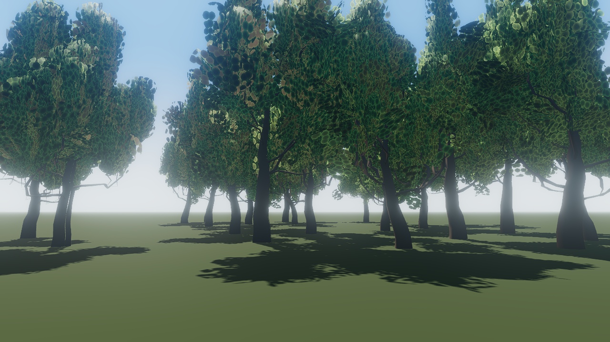
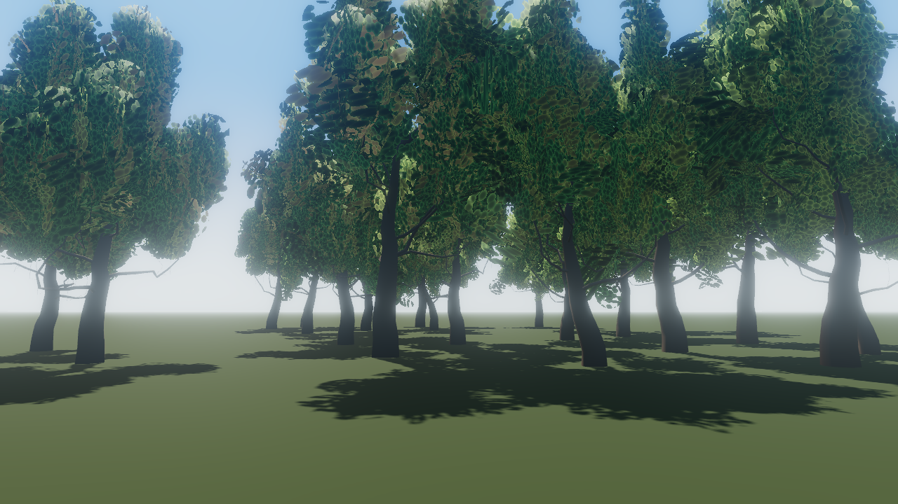
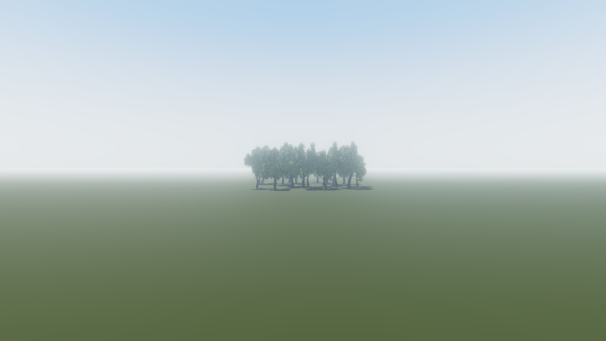

# grove

22 procedurally generated trees swaying in a TSL wind, on the published `create-threenative@0.2.6`
`minimal` template. The demo for ThreeNative PR #333 (procedural vegetation).



- `scripts/author-trees.ts` (`pnpm trees`) — offline: EZ Tree variants for seeds 11/23/37/51,
  written to `assets/trees/*.glb`. The generator never ships (`pnpm check:no-generator`).
- `src/scenes/Play.ts` — loads the cooked GLBs, re-materials them by glTF material name, places 22
  clones, pads bounds per variant, and reports LOD state from `baseGeometryOf`.
- `src/render/wind.ts`, `src/render/trees.ts` — the integration's TSL wind (world metres, baked
  `_wind` weight) and this game's look: bark, procedural leaf cut-out in `maskNode`, dappled shadows.
- `threenative.config.ts` — `assets.lod: {}` bakes bark levels (leaves are alpha-masked, so LOD0);
  `models.passes.prune: false` keeps the `uv` and `_WIND` the game's materials read.
- Playtests: `grove` (22 trees, wind moves the frame; amplitude 0 goes red), `grove-lod` (sweep out
  to 3 km: all 14 bark geometries drawn, leaves never coarsen), `atmosphere`, and the native
  `grove.desktop.json` / `grove-lod.desktop.json`, run on desktop and the Android emulator.

| Web (WebGPU, RTX 2080) | Desktop native (Vulkan) | Android emulator (host GPU) |
| --- | --- | --- |
|  |  |  |



```sh
pnpm install && pnpm dev   # or: pnpm test
```
