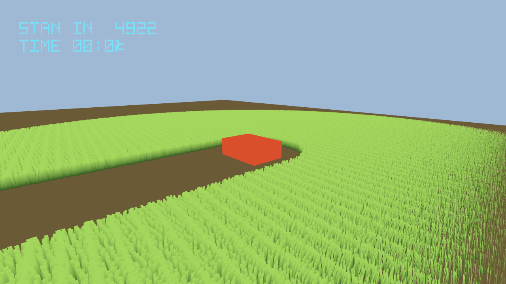

# Last Harvest

Drive the harvester across a field of **1,048,576 candidate blades** and cut it down. **Arrow keys**
drive. The blades you have cut stay cut, and nothing on the CPU knows which ones they were.

```sh
pnpm dev
```



## Features this validates

| Mined feature | PRD | What the game asks of it | State the proof reads |
| --- | --- | --- | --- |
| A million-candidate GPU field, culled and compacted with an atomic counter | 255 | The field itself. One thread per candidate decides whether its own blade survives and claims a slot with one `atomicAdd` | `candidateCount`, `cullDispatches` |
| A draw whose instance count the GPU wrote | 255 | `IndirectStorageBufferAttribute` + `geometry.setIndirect()`. The CPU never sets an instance count and never learns one | `indirectBound`, `standingNow` |
| Reset strictly before the candidate pass | 255 | A separate one-thread pass clears the counter; every thread of the next pass adds to it | `resetDispatches` |
| GPU-resident cut state as the win condition | 255 | **The rule.** Blades cut are counted by a second atomic counter and read back. Nothing on the CPU knows which blades fell | `cutTotal`, `outcome` |
| `GPUReadback` — throttled, staleness-reporting | 246 | Gets that count to the CPU without stalling the frame | `cutTotal` |
| The projection cannot fold an indirect geometry | 255 | The field is an ordinary `Mesh` with an ordinary material; only its indirect buffer makes it special | `indirectBound` throughout |

`packages/core` contains **no grass vocabulary at all** — no blade, species, biome, density or
foliage anything. It sees an `Object3D` implementing `IComputeDriven` plus a `GPUReadback`. The
candidate grid, the placement hash, the acceptance rule, the blade geometry, its material and its
palette are all in `src/render/grass.ts`, and a different game would write completely different ones
against the same seam.

## What the proof caught

**The compute pipeline did not compile, and the game declared itself won.** The reset pass cleared
the survivor counter with a plain assignment:

```
Error while parsing WGSL: :55:29 error: cannot assign 'u32' to 'atomic<u32>'
  NodeBuffer_994.value[ 1u ] = 0u;
```

An atomic buffer element is `atomic<u32>` in WGSL and needs `atomicStore` / `atomicLoad`. Everything
typechecked on the CPU; the failure arrives at pipeline-creation time, in the browser, as 4,358
console errors. With the pass dead the counter read zero, the game saw "no blades standing" and
announced a cleared field on the first frame. A field can only be cleared if it was standing first.

**The number that looks like the win condition is the wrong number.** The drawn survivor count is
nearly constant however far the harvester drives — a fixed-radius cull circle leaves cut grass behind
and takes in fresh grass at the same rate. It is the right number to *draw* with and a useless number
to *play* with. The rule moved to a second atomic counter for blades cut, which only ever goes up and
only because the player drove somewhere.

**A long `holdTicks` step starves the readback.** The scenario pumps the fixed-step clock far faster
than real time, and an async GPU→CPU copy needs the event loop. Across two 300-tick steps the copy
landed **twice in 900 dispatches**, so `cutTotal` sat frozen at 4,843 — the blades cut while the
harvester was still parked at the origin — and every assertion that depended on it failed while the
GPU was doing its job perfectly. Twenty-five short steps land it repeatedly. **A readback-driven rule
cannot be proven by one long step**, and the same limit put the sibling ocean's staleness at 78
frames.

**A green run with a useless picture.** The first passing run drove 131 m across a 120 m field, so
the capture was empty sky with a corner of grass in it. The harvester is now held inside the field
and the camera looks *along* the swathe rather than down at it — a top-down shot of a mown strip is
indistinguishable from a shot of bare ground.

## Running the proof

```sh
./tools/capture-lock.sh pnpm exec threenative-playtest \
  --scenario playtests/clear-the-field.playtest.json \
  --browser-recipe webgpu --headed \
  --server-command "pnpm dev --host 127.0.0.1 --port \$PORT --strictPort"
```

Green, exit 0, twice in a row, on `nvidia / turing`:

```
candidateCount   1048576 (held)      cpuCandidateWrites  0 (held, throughout)
indirectBound          1 (held)      resetDispatches   220 -> 904
cullDispatches       220 -> 904      standingNow    201035 -> 172824
cutTotal            4843 -> 41708    driven              0 -> 70
outcome       harvesting -> cleared
```

Red controls, each reverted:

| Mutation | Result | Exit |
| --- | --- | --- |
| never `ctx.add` the field | `resetDispatches` 0, `cullDispatches` 0, `cutTotal` 0, `standingNow` -1, outcome never leaves `harvesting` | 1 |
| drop the reset pass | the counter never clears and accumulates across frames: `cutTotal` **1,695,050 → 3,101,015**, more blades cut than exist, and the field reads `cleared` at step zero | 1 |
| remove `geometry.setIndirect()` | `indirectBound` 0 — the draw no longer obeys the count the compute pass wrote | 1 |

The second one is the sharpest: without the reset the field still renders, still looks correct, and
reports having cut three times more grass than the field contains.

## Known limits

- The survivor count reaches the CPU only as fast as the browser services an async copy. Under a
  tick-driven scenario that is a handful of landings, not one per frame. The HUD is therefore a few
  hundred milliseconds behind the field, which is the documented contract, not a defect.
- Nothing here is measured on native or on a device. Desktop and Android are `UNVERIFIED`.
