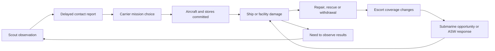

# PRD-midway-asset-battle-integration — A fleet with jobs to do

**Status:** IN PROGRESS
**Complexity:** 7 (HIGH); risk override: none.
**Owner:** Midway game implementation lane.
**Depends on:** Current sortie/recovery behavior; asset corrections in Phase 1.
**Progress:** Phase 1 remains partial on measured geometry/moving-part gaps. Phase 2 has render identity, pure ship geometry and a working carrier inventory cycle; AI engine-flight migration remains open. Phase 3 intelligence is wired, while naval/facility integration and Phases 4–5 remain incomplete.
**Platforms:** WebGPU web acceptance. Desktop/Android/iOS remain unverified unless their target playtests run.
**Estimate:** 95–150 engineering hours, including asset preparation, AI tuning and playthroughs. Significant remodelling can exceed this estimate; reassess after Phase 1.

Implementation is under way. Keep acceptance in this existing PRD; no parallel task ledger. Complexity comprises 11+ implementation files (+3), new naval/intelligence behavior (+2), and interacting operational state (+2). No engine package release is currently assumed.

## Outcome and decisions to review

**Every supplied asset must earn its place through a battle capability the player can observe and affect.** A model substitution alone does not complete integration. Historical roles constrain equipment and decisions; the simulation must allow different targets, survivors, attack timing and outcomes.

| Decision | Proposed behavior | Alternative and consequence |
|---|---|---|
| Player role | Keep the U.S. pilot experience. Make the already-selectable TBD use its own exterior, cockpit sightlines and working parts; Kate remains an AI aircraft. | A playable Japanese campaign changes briefing, commands, recovery and victory rules; outside this integration. |
| Realism | Real local dimensions, credible aircraft/weapon performance, finite resources and uncertain information. Keep current flight assists. | A full June 3–7 campaign with historical distances needs different pacing and save/progression design. |
| Battle design | Give groups objectives and units capabilities. Choose actions from observations, readiness and threats. | Replaying named historical incidents would violate the request. A cosmetic swap would leave most assets without useful roles. |
| Historical identity | Correct misleading files before admission. Reuse a class model for sister ships only after checking configuration. | Temporarily retaining existing procedural models is acceptable during development; claiming a wrong imported hull is complete is not. |
| Completion | Deliver all five phases, including scouts, surface groups, submarines, rescue/salvage, island effects and player access. | Phase 2 is a useful intermediate playable build, not completion of this PRD. |

### What the player experiences

1. Choose an assignment and SBD or TBD; deck activity reflects aircraft actually preparing or recovering.
2. Find/report contacts or protect a scout. Reports enable strikes; old reports can lead to an empty patch of sea.
3. Attack a carrier or surface target, escort the wing, or help defend a friendly ship. Opponents react to what they know.
4. Notice consequences: fewer enemy launches, an escort leaving formation, a submarine forced deep, or a damaged carrier reopening for recovery.
5. Return to an available deck. The debrief distinguishes personal results, ordered-wing results and changes elsewhere in the battle.

Keep current keyboard, camera, wing orders, H return guidance and L final assist. Extend existing briefing/map/radio/debrief surfaces, with text as well as color. No strategy screen, direct ship control or new cockpit chores. `R` remains reporting; map target selection and the existing attack order work for newly eligible targets.

## Evidence and scope

Inspected 2026-09-13 at sandbox commit `30c3fd8`, with pre-existing local edits in `index.html`, `src/hud.ts`, `src/scenes/Midway.ts`, `src/sim/battle.ts`, `src/sim/recovery.ts` and `src/style.css`. Those edits belong to the current working state. During planning, the other lane committed the sortie/UI/recovery work as `52b58ea`; final document review used that checkout. Execution must preserve the integrated changes and reconcile with their owning lane.

Read the supplied overview first: `/home/joao/.codex/attachments/304de1e5-e066-4aa8-966b-a343780e3c99/pasted-text-1.txt`. Its historical anecdotes are context, not instructions to script losses. Sources below resolve important detail; wartime reports can contain identification and damage-assessment errors.

Source assets: `/home/joao/Downloads/midway-missing-models`. GLB headers and `node tools/inspect-glb.mjs <files>` establish the inventory below. Private background Blender renders covered all twelve unique models, two views each; inspected `/tmp/midway-asset-plan-previews/sheet-{0,1,2}.png` and the four naval PNG references. These are local inspection aids, not in-game visual acceptance. OpenCode `opencode-go/deepseek-v4.1-flash` completed read-only source exploration; its units and broad claims were checked against the relevant source before inclusion.

### Existing behavior to extend

| Boundary | Current source evidence | Required consequence |
|---|---|---|
| Aircraft selection | `armament.ts:LOADOUTS` already selects TBD; `world.ts:setAirframe` draws a procedural Dauntless for any non-SBD player. AI imports are selected by team/kind. | Select by explicit airframe identity for player, AI, parked aircraft and LOD; do not send a new imported aircraft through `animateDouglas`/`disposeDouglas`. |
| Flight | `flight.ts:AircraftFlight` wraps engine `FlightModel`. AI `tactics.ts:steerAircraft` separately integrates bank, pitch, speed and position. Kate constants currently use span 14.9 m and area 34.6 m². | Use engine flight for AI as well; tactics supplies controls. Correct B5N2 data, with measured calibration, rather than introducing another force model. |
| Carriers | `battle.ts:setupFleet` already creates all seven carriers, Tone/Chikuma, Hammann, Arashi/Nowaki and both submarines. `imported-ships.ts:createIjnCarrier` rescales Akagi for Kaga/Soryu/Hiryu; Yorktown draws Hornet. | Replace named render substitutions; preserve unit identity. Mogami-class support group is genuinely new. |
| Operations | `launch` consumes a generic reserve of 12; `updateShips` chooses types by a modulo sequence; `navigateHome` returns one reserve. Fuel and ordnance do not constrain repeated carrier rearming. | Track recoverable airframes separately from finite stores and preparation work; a recovered plane is not a new plane or free torpedo. |
| Intelligence | `updateIntel` detects by radius and copies exact name, deck health, position and course; `selectNavalTarget` does reject reports older than 240 seconds. Submarine targeting bypasses reports and reads the nearest live enemy carrier directly. | Preserve report ageing; add observer limits, classification uncertainty, delivery delay and submarine perception. Do not describe current targeting as entirely unbounded or wholly omniscient. |
| Navigation/targets | Ships move independently; torpedo evasion exists, formation keeping does not. AI naval targeting, HUD contact selection and sortie hit eligibility favor carriers. Manual weapons can already hit other surface ships. | Wire all target consumers together so escorts/cruisers become deliberate assignments; preserve carrier-strike credit rules. |
| Recovery/geometry | `world.ts:sizeCarrier` mutates sim dimensions during rendering; `length/width` mean launch corridor on the home carrier and damage bounds elsewhere. A global deck height feeds approach and crew placement. | Initialize pure ship dimensions before any render. Separate hull, deck and launch/recovery geometry, including per-carrier deck height. |
| Submarines/island | Submarines surface on a sine timer and fire repeat spreads; no meaningful ASW response. Midway is a location plus rendered facilities. | Add depth, ammunition, observation-driven attacks, escort ASW and useful infrastructure. |
| Presentation/budgets | Ten-detail-aircraft admission with hysteresis, ship LODs, shared GLTF resources, 68 live AI aircraft and 20 ocean wake slots already exist. Hornet and Yorktown both park B-25s through the shared non-Enterprise rendering branch. | Keep bounded rendering, correct the Midway deck park, and audit capacities when adding the cruiser group. |

All simulation lengths are metres, time seconds and speeds m/s. Existing torpedo speeds 17.25/21/24 and release maxima 57/88 are **m/s, not knots**. Convert only at the HUD boundary and label units.

## Asset disposition, scale and animation

### Measured inventory

All thirteen GLBs report Tripo as generator, one mesh, one material, three embedded images, zero skins and zero animation clips. Each contains a fused hierarchy, with no separately named propeller, gun, gear or periscope. “No clip” therefore requires geometry preparation, not merely starting an animation. Raw XYZ bounds below are source units **before alignment**; several hulls are diagonal, so bounding-box ratios alone do not establish distortion.

#### Aircraft

| File under source directory | MiB / triangles / SHA-256 prefix | Raw XYZ | Admission work |
|---|---|---|---|
| `aircrafts/Douglas+TBD-1+Devastator.glb` | 59.83 / 1,915,063 / `5a34e311560b` | .75 × .27 × .98 | High-detail source only. Separate prop, gear, surfaces, hook and stores; optimize hero/AI versions. Validate the long canopy, wing planform and suspicious perforated trailing-edge treatment against TBD references. It must not inherit Dauntless dive brakes. |
| `aircrafts/Nakajima+B5N2+Kate+Torpedo+Bomber.glb` | 2.45 / 9,793 / `5c9cd0b4b059` | .92 × .37 × .98 | Preserve useful texture detail; correct orientation and proportion if necessary. Separate prop, inward-retracting mains, hook, flaps, rear-gun mount and stores. No need to decimate an already small mesh automatically. |

TBD target: **15.24 m span, 10.67 m length**, from the [USS Midway Museum aircraft entry](https://www.midway.org/visit/aircraft-gallery/tbd-devastator) and [NHHC aircraft specifications](https://www.history.navy.mil/content/dam/nhhc/research/histories/naval-aviation/dictionary-of-american-naval-aviation-squadrons-volume-1/pdfs/app1-3.pdf). B5N2 target: **15.5 m span, 10.3 m length, 37.7 m² wing area**; the [Pearl Harbor Aviation Museum](https://www.pearlharboraviationmuseum.org/news/blog-archives/nakajima-b5n2-kate-type-97-3-carrier-attack-aircraft-at-pearl-harbor/) also distinguishes its torpedo and level-bombing roles. Treat empty mass, usable fuel and engine power as separate quantities; loaded weight cannot be used as empty mass and then receive stores again. Derive guns by airframe/configuration too: Kate has a rear defensive gun, not the generic forward Japanese gun; a player TBD must not inherit the SBD’s gun battery by default.

#### Carriers

| File | MiB / triangles / SHA prefix | Raw XYZ | Admission work |
|---|---|---|---|
| `carriers/uss-yorktown.glb` | 60.70 / 1,875,769 / `dd1db981ea47` | .25 × .39 × .98 | Optimize; check CV-5 configuration, island, deck markings, clear landing corridor and rigging height. Own model for Yorktown only. |
| `carriers/japan-kaga.glb` | 3.42 / 45,683 / `f8157c4b810f` | .55 × .53 × .98 | Align hull before measuring. Check starboard island and Kaga's hull/funnel/deck arrangement; replace its Akagi copy. |
| `carriers/japan-soryu.glb` | 3.10 / 23,605 / `d34168769819` | .49 × .52 × .98 | Check starboard island and Sōryū silhouette; cannot inherit Kaga's proportions just because both have a starboard island. |
| `carriers/japan-kyriu.glb` | 3.34 / 23,421 / `1520303a2c04` | .21 × .35 × .98 | Interpret filename as a **Hiryū candidate**, not proof. Verify port island, funnel side and flight deck, then import as `hiryu`. |

Initial Japanese length references already used in `IJN_CARRIERS`: Kaga 247.65 m, Sōryū 227.5 m, Hiryū 227.4 m. Reconcile with dated drawings before baking, especially hull beam versus flight-deck width. For Yorktown, [DANFS](https://www.history.navy.mil/research/histories/ship-histories/danfs/y/yorktown-iii.html) lists a 809 ft 6 in length (246.74 m); do not automatically equate that hull figure with the overall flight-deck envelope or copy the existing 251.58 m sister-ship mesh measurement. Record the measurement endpoints used.

#### Surface ships, submarines and weapon

| File | MiB / triangles / SHA prefix | Raw XYZ | Admission work |
|---|---|---|---|
| `cruiser/tone-class-cruiser.glb` | 4.01 / 47,991 / `0f57ef7e9740` | .97 × .57 × .98 | Candidate for Tone/Chikuma. Check four main turrets forward and aft aviation area; duplicated file is not proof of two classes. |
| `cruiser/mogami-class-cruiser.glb` | 4.01 / 47,991 / `0f57ef7e9740` | Same | **Byte-identical to Tone file.** One shared source, not a second model. Correct/derive a June 1942 Mogami layout before admission. |
| `destroyers/japan-mikuma-and-mogami.glb` | 3.38 / 22,650 / `882f14114090` | .15 × .33 × .98 | Render looks destroyer-like rather than a validated Mogami cruiser. Compare with the Kagerō PNG and class drawings; possible misplaced Kagerō candidate. Never scale it to cruiser size merely from the name. |
| `destroyers/uss-harmann.glb` | 3.56 / 22,887 / `fc329841741b` | .15 × .38 × .98 | Normalize name to **Hammann, DD-412**, after Sims-class and 1942 armament checks. Use for Hammann; do not silently reskin Phelps/Balch, which are different classes. |
| `submarines/japan-I168-submarine.glb` | 3.28 / 23,243 / `3ed26ed8ee03` | .98 × .55 × .76 | Align diagonal hull; validate I-168 configuration, tower and tube locations. Separate periscope and visible moving parts. |
| `submarines/uss-nautilus.glb` | 3.44 / 22,967 / `f39a975336cf` | .13 × .34 × .98 | Validate **SS-168**, not nuclear SSN-571; check Narwhal-class hull and two large deck guns. |
| `destroyers/torpedo+3d+model.glb` | 2.78 / 24,856 / `7fc4cc6127f4` | .99 × .15 × .15 | Generic long torpedo candidate, nose along a different axis from the game. Identify/correct body diameter, length, tail and screws for each admitted variant; not a universal scale-only Mark 13/Type 91/naval torpedo. |

Hammann reference: **106.17 m length, 11.00 m beam** from [DANFS](https://www.history.navy.mil/content/history/nhhc/research/histories/ship-histories/danfs/h/hammann-i.html). Nautilus: **113.08 m length, 10.13 m beam**, with separate surface/submerged speeds, from [DANFS SS-168](https://www.history.navy.mil/content/history/nhhc/research/histories/ship-histories/danfs/n/nautilus-ss-168-iii.html).

For preliminary layout only, reserve roughly 202 m for Tone-class, 201 m for Mogami-class, 119 m for Kagerō-class and 103 m for I-168. These rounded planning allowances are **not verified conversion constants**. Phase 1 must replace them with dated class measurements and hull/waterline/deck endpoints before import. Weapon variant dimensions likewise require identification before conversion.

All eight supplied PNGs are references, not extra game entities: the two aircraft images, `torpedo.png`, Kagerō, Mikuma and `uss-harman.png` images, and the two cruiser images. Their class labels are not authoritative: the cruiser references also show potentially misleading turret/aviation arrangements. Establish the June 1942 ship configuration using historical photographs/drawings, not image similarity alone. No Kagerō-named GLB exists; resolve the destroyer-shaped candidate before commissioning another model.

### Preparation contract

1. Preserve original Downloads files. Record source hash, author/generation provenance and distribution rights in the game's asset credits when importing; a Tripo generator tag does not establish a license. No supplied license document was found. Planning is not blocked by that; public distribution requires recording the actual rights.
2. Work in a private background Blender session. Establish bow/nose, centreline, waterline/gear contacts and correct upright axes. Bake to metres, +Y up and forward −Z. Apply **uniform** scale after alignment; use localized geometry repair where proportions are wrong. Do not hide errors by independently stretching X/Y/Z.
3. Keep numeric model dimensions and attachment points in a small game-owned `src/sim/catalog.ts`, initialized before `Battle.setupFleet`; render code consumes them. Separate `hullLength/hullBeam`, deck outline/height and launch/recovery corridor. Weapons collide with the relevant hull/deck zones regardless of camera or LOD.
4. Preserve textures/UVs while separating rigid moving pieces. Use ordinary pivot Groups and existing animation conventions; skeletons only for deforming crew. Export with `--vertex-layout separate`. Reject missing required pivots, detached blades, seams, warped gun barrels, invented hull parts and texture loss.
5. Produce close and distant representations with matching identity, size and waterline. Initial ceilings: TBD hero 120k triangles, TBD/Kate AI 25k, Yorktown 200k, other new carriers 60k, cruiser 50k, destroyer/sub 30k, torpedo 3k; far ships 3k and far aircraft 1.5k. These are planning budgets, not measured performance or permission to lose silhouettes. Share materials/textures, load via `ctx.assets`, and dispose instance-owned additions only.

A rejected source still has an explicit destination: correct its geometry from that source and references, or replace it with a verified class model during Phase 1. The duplicate cruiser may become the source for a genuine second class, not a redundant draw. Do not reduce final scope by leaving Mogami/Kagerō identity unresolved.

### What must move

| Subject | Required state-driven motion | Useful check |
|---|---|---|
| TBD/Kate propulsion | Isolate blades/hub, pivot on shaft. Smooth normalized engine RPM, low-speed blades and high-speed blur; engine damage/cut changes spin and sound. | Nose stays still; blades rotate about the shaft. Pause freezes them; two instances at different RPM do not share transforms. |
| Aircraft flight/deck | Gear, wheel rotation, hook, flaps, ailerons, elevator, rudder and rear-gun traverse. Wing folding only while stationary with clearance; TBD and Kate folds differ. | Full deployment range clears fuselage/deck; no SBD dive-brake animation on either torpedo bomber. Flight controls and damage affect visible surfaces. |
| Stores | Separate carried torpedo/bombs and racks. Release removes the actual carried object, reduces payload, then creates one free weapon at its attachment transform. | No baked torpedo remains under an empty aircraft; no double store from `buildAircraft` adding its procedural torpedo. |
| Ships | AA traverse/elevation follows directors; muzzle origin follows mounts. Elevator and parked aircraft reflect flight operations. Flags/wakes reflect wind/speed; damage drives list, smoke and sinking. | No timer-driven elevator through parked planes, infinite deck park or wake on a stationary/deep submarine. Large surface guns do not track fighters as AA. |
| Scouts/submarines/salvage | Catapult launch, floatplane water pickup/crane, periscope extension and diving; survivor boats and alongside hoses appear only during actual rescue/salvage. | Scout cannot launch again while still airborne; deep boat has no visible surface hull/periscope; salvage connections detach before ships separate. |

Borrow the existing Douglas prop-blur approach, without forcing every airframe into its exact clip set. Missing cockpit internals require a simple type-correct cockpit/canopy arrangement for the player TBD; the SBD's instruments, dive-brake panel and sightlines must not masquerade as a TBD cockpit. Shared gauges may be reused where appropriate. Underwater screws need animation only when exposed to the camera; no new underwater cinematic system.

## Battle roles and agendas

Historical anchor: [NHHC's Midway account](https://www.history.navy.mil/browse-by-topic/wars-conflicts-and-operations/world-war-ii/1942/midway.html) establishes the carrier battle, subsequent cruiser pursuit and submarine threat to salvage. The following priorities are **game design derived from those roles**, not a transcript of historical orders.

### Air war

| Unit | Assignment and decisions | How it changes the battle |
|---|---|---|
| TBD Devastator | U.S. carrier torpedo attack. Assemble with escort, use a fresh contact estimate, approach low, choose a legal release solution, release once, evade and return/divert. Abort an unusable approach or inadequate fuel. | Coordinated attacks split defensive attention and threaten flooding/propulsion. Unescorted attacks are vulnerable because of geometry/performance, never a scripted casualty multiplier. |
| B5N2 Kate | Japanese torpedo or **level-bombing** loadout chosen before launch. Island targets call for bombs; identified ships can justify torpedoes after a real rearm delay. Do not fly Val-style dive attacks. | Creates low-level carrier threats or damages island facilities; resource and contact changes alter which mission is launched. |
| Existing SBD/Val | Retain dive-bombing roles and give their waves actual aircraft/stores/escort availability. | A low defensive CAP can create a high approach opportunity; no “torpedo wave arrived → carriers automatically vulnerable” rule. |
| Existing Wildcat/Zero | Local CAP versus escort commitment, altitude coverage, fuel/ammo and return decision. Sections may cooperate; escorts stay with their assigned strike unless a local threat or order justifies separation. | More escort protection means fewer fighters at home. CAP pursues sensed threats, not every enemy's exact position. |
| PBY and new cruiser floatplane | Finite scouts, assigned search sectors, reports, fuel reserve and recovery. Add a recognizable procedural Japanese floatplane if no validated model exists; do not call a carrier-launched Val a Tone scout. | Detection creates a targeting opportunity; interception creates a search gap. No killed scout emits future reports. |

No new premium models are necessary for Val/Wildcat/PBY just to finish this asset integration; keep their existing honest procedural identities. A6M3 currently substitutes for Midway's A6M2: disclose it in the asset description and avoid calling the whole roster visually exact. Correcting that existing variant is a separate asset task unless the new airframe checks expose a directly affected incompatibility.

### Carrier groups

All carriers can launch, recover, fight fires, maneuver and become disabled or sunk. Differentiate by available air group, deck, damage state and location; names do not receive survival or targeting exceptions.

| Asset/group | Agenda | Meaningful player effect |
|---|---|---|
| Enterprise/Hornet | Operate together in the U.S. striking group; choose CAP, launch strike packages, receive returning/diverting aircraft and preserve sea room. | Home operations depend on surviving decks and stores. Replace the decorative B-25 parks on **both Hornet and Yorktown** with actual carrier aircraft; B-25s are not a Midway carrier strike type. |
| Yorktown with Hammann | Separate U.S. carrier group, mutually supporting the main force. Repair recoverable damage and accept diverted aircraft when capable. | Defending Yorktown preserves another launch/recovery option. If damaged, its salvage is an opportunity; it can survive, sink earlier or never require salvage. |
| Akagi/Kaga | Strike Midway when suppression is still required and no higher-value fresh carrier contact changes priorities. Conserve CAP and avoid launching into unsafe deck conditions. | Kaga adds real sortie capacity; damaging it removes specific ready aircraft/stores or work capacity, not just generic hit points. |
| Sōryū/Hiryū | Same operational rules in the other Japanese carrier division. Any operational carrier with information and resources can lead a follow-up strike. | Hiryū is neither invulnerable nor guaranteed to be last. Sōryū can survive and counterattack instead. |

Carrier cycle: `available → preparing → deck-ready → launching → airborne → recovering → servicing → available`, with loss/diversion branches. Individual aircraft identities move between states; aircraft, crew, fuel and ordnance are conserved. At the 68-aircraft active cap, keep a launch queued without charging resources until launch succeeds. Maintain per-type inventories and one shared flight-deck occupancy schedule, not a universal modulo spawn pattern. Parked visual instances represent those same inventory records; they are not extra flyable aircraft.

Make preparation/recovery times explicit game tuning, preserving their order and cost. Initial preparation/service times are measured in simulated minutes; emergency firefighting can restore limited capability without restoring hull integrity or spent stores. Launching and recovery conflict on a straight deck. Turn into wind only when operational intent and sea room permit; suspend launch/recovery during emergency evasion, heavy list, fire in the corridor or occupancy conflicts. Use the same eligibility values in the HUD and sim.

### Surface groups

| Unit | Agenda and constraints | Consequence |
|---|---|---|
| Tone/Chikuma | Maintain carrier-screen stations, operate cruiser scouts, provide plausible AA and retain contact reports. Scout handling slows/turns the ship and competes with evasive maneuvering. | Attacking aviation facilities reduces future search coverage. Losing one cruiser does not delete reports already transmitted. |
| Mogami/Mikuma; same class for Kumano/Suzuya | Add a **separate supporting cruiser group**, with an approach/hold/withdraw route. Approach bombardment range only under orders and acceptable air threat; otherwise preserve the group. When damaged, slow/withdraw and assign an escort. | Gives recon and subsequent anti-shipping sorties a real target. A damaged cruiser can escape; enemy withdrawal does not teleport it off-map. |
| Kagerō-class candidates, including Arashi/Nowaki | Screen, plane-guard, investigate submarine reports, conduct finite ASW attacks, rescue survivors, then rejoin. | An escort leaving to hunt or rescue opens a real gap. Its return course can be visually followed, without spawning a clue or directing the player to it automatically. |
| Hammann | Screen/plane-guard near Yorktown; rescue viable survivors; provide firefighting/power alongside a crippled friendly carrier when locally safe. | Assistance slows flooding/fire at a cost in escort coverage and maneuverability. Abort alongside operations on a detected torpedo threat. It is not forced to die or to tow an entire carrier. |
| Existing Northampton, Phelps and Balch | Retain their distinct cruiser/destroyer identities and existing/procedural visuals; assign screen, AA, plane-guard and applicable rescue/ASW capabilities by their own configuration. | They share the new targeting and formation consumers. Do not delete them or turn them into Hammann clones when adding the new naval models. |

Use formation offsets in a moving group frame, attainable speed/turn limits and predicted closest approach for separation. Evasion temporarily outranks station-keeping; the ship rejoins smoothly rather than snapping back. Route around the atoll/reef and leave water for turns. Ships cannot independently overwrite each other's course authority. If collision handling is enabled, damage follows physical proximity and relative motion; **no Mogami–Mikuma collision is required**. Scuttling, if needed for irrecoverable vessels, is a conditional crew/command decision after rescue, not a named-ship trigger.

### Submarines, torpedoes and ASW

| Asset | Agenda | Counterplay |
|---|---|---|
| Nautilus SS-168 | Patrol a plausible Japanese approach, observe at periscope/surface depth, report when radio conditions allow, attempt a reachable intercept, fire finite tubes, evade and withdraw/recharge when necessary. | It can force escorts out of formation or a carrier to turn, even without a hit. It cannot chase a full-speed carrier underwater or always know the carrier's location. |
| I-168 | Patrol the U.S. approach/island area, use delivered contacts to seek opportunities, favor a reachable high-value ship and withdraw under serious ASW threat. | A slowed carrier is attractive but Yorktown is not hardwired. Detection and screening can prevent the attack entirely. |
| Torpedo variants | Mark 13 for TBD, Type 91 for Kate, appropriate submarine/surface types for their launchers. Finite stock, tube/rack origin, running depth, arming distance, speed/range and family-specific reliability. Straight-running after release. | Legal release does not guarantee a hit; target turns and interception geometry matter. No homing, no team-wide shared “torpedo” dimensions and no unlimited submarine spreads. |
| Escort depth charges | Sonar/visual contact estimate → investigation → attack track → finite salvo with preset depth → reassess/search/rejoin. | Lost contact grows uncertain. A depth charge sinks and detonates by depth; damage uses three-dimensional separation, not a surface-circle hit. |

Submarine state adds continuous `depth` (positive downward), depth rate, surfaced/periscope/deep modes, battery/endurance, tubes/reloads and last observations. Surface navigation is faster but visible; submerged movement is quieter/slower and consumes endurance. No periodic sine-wave surfacing. A submarine's own information is separate from fleet radio knowledge: surfacing/transmitting has a cost; underwater messages are not instantaneous omniscient retasks.

Detection must consider observer position, range, line of sight/horizon, depth, daylight/visibility and the noise of a fast escort. Hydrophone contacts can give bearing/uncertainty without exact range or identity. After a contact is lost, search its estimated area; use local sensor facts for attack solutions. Ordinary strafing cannot damage a deeply submerged boat. Surface bombs can affect a shallow submarine only through a deliberately defined underwater blast path; otherwise they miss, rather than silently sharing a ship damage rectangle.

Use actual torpedo run depth and swept hull intersection. A shallow destroyer alongside a carrier must not be automatically hit before every deeper-running torpedo reaches the carrier; nor must the simulation reproduce the historical Hammann/Yorktown hits. Candidate reliability settings are seeded, weapon-specific game approximations with stated provenance, not guaranteed historical failures or falsely precise probabilities.

### Midway and information

The atoll is a functional base with individually hittable facilities. Five small categories suffice: **runway/aircraft service, fuel/ordnance stores, radar, radio, seaplane area**. Reuse the existing garrison/AA/coastal positions where present; add only geometry necessary to communicate these functions. Radar gives air-warning tracks, not enemy ship names/deck health; radio affects report delivery; losing the seaplane area/fuel limits PBY operations. Runway damage affects land-based aircraft, not every seaplane. Fuel fires can spread locally; one disabled radar does not magically close the whole base. Repair consumes work/time and can be interrupted.

Japanese commanders evaluate reported suppression results to decide whether another island strike is worthwhile. No 06:30 scripted raid or compulsory “second strike required” message. Coastal guns affect ships that actually enter their arcs/range; they do not create a battleship duel elsewhere. An invasion/infantry campaign is outside scope.

Use HYPO intelligence as the rationale for the U.S. starting search/ambush area, not exact live targeting. The [NHHC reconnaissance discussion](https://www.history.navy.mil/about-us/leadership/director/directors-corner/h-grams/h-gram-006/h-006-2.html) supports the importance of scouts and information limits. Keep historical order-of-battle numbers distinct from a deliberately smaller playable roster.



This is a causal loop, not a prescribed event order. In particular, destroying one scout must not prevent all other observers from detecting the fleet, and a report transmitted before that scout dies can still arrive.

## Implementation shape and invariants

### Minimal data and ownership

Keep plain game records and explicit functions; no ECS, planner framework, generic mission schema or behavior-tree library.

| Record / owner | Added fields and responsibility |
|---|---|
| `src/sim/catalog.ts` (new) | Small typed definitions for airframe/ship/weapon identity, numeric dimensions, mount/attachment positions, capacities and initial tuning. Constants carry units/source notes. It imports no Three.js and does not create a runtime asset registry. |
| Existing ship/aircraft records, mutated by `Battle` | Explicit `modelId`, `classId`/`airframe`, group/home id, assigned task/target, task start/reason, damage and capabilities. Carrier inventory is per airframe and per store family. Submarine-only fields stay on submarines. |
| Contact records, `src/sim/intel.ts` (new) | Observer id, observed/delivered times, last position/course estimate, classification/confidence, error radius and observed status. Separate each team's records from internal entity truth. Exact damage state is not automatically public. |
| `src/sim/naval.ts` (new) | Group/course decisions, ship station-keeping, patrol/ASW/rescue/salvage transitions and finite naval resources. `Battle` invokes these on its existing fixed step and remains mutation owner. |
| Existing sortie/events | Add explicit surface-strike/support variants and observed results while retaining release-time stamps, `pending` impact confirmation and the single frozen debrief record. Effects/audio consume events; they never cause damage or decide an objective. |

One source of task truth feeds action, map status and radio. Evaluate strategic priorities at a coarse cadence (initially once per simulated second) with commitment/cooldown to prevent indecisive switching; integrate movement/weapons on the existing fixed step. All randomness uses `Battle`'s seeded generator. Pausing, accelerated time and rendering LOD cannot change inventory, decisions or hit outcomes for equivalent simulation inputs.

Priority order: immediate survival/evasion → safe recovery and local defense → existing committed task → new opportunity → patrol/formation. Give tasks a reason such as `low fuel`, `no fresh contact`, `escort requested`, `carrier repair assistance`, or `withdrawal ordered`. Re-evaluate when new information, damage, stock or orders materially changes feasibility. No name-based immunity, automatic attack on Yorktown, compulsory Hiryū final phase, or historical sinking timer.

### Flight and damage integration

Replace AI's force-like integration in `steerAircraft` with a controller producing engine controls for one `AircraftFlight` per airborne aircraft. Reuse tactical state transitions; remove the old velocity/bank integrator after parity checks. Validate loaded TBD takeoff and low-level release before tuning fleet waves. A bomber must lose speed/altitude when power or control authority is lost; don't retain the current universal speed floor. Initialize every required `IFlightState` field with finite values, standardize normalized fuel versus fuel mass, and count stores once. The controller writes throttle/configuration to aircraft state and passes the installed `IFlightControls` fields (turn/pitch/rudder/autopilot); do not assume a throttle control argument. Carrier AI departures must also leave the existing synthetic launch motion and enter through a queued `stepDeck` run before switching to airborne engine flight. This is the largest tuning risk in the plan; measure the full supported population before treating the migration as complete.

Per-deck launch uses the installed `FlightModel` environment's `deckHeight` override and `IFlightDeck` dimensions; the local wrapper must supply the selected deck's numeric geometry. Recovery, `finalReady`, touchdown, visuals and deck crew use that same datum/corridor, rather than introducing parallel eligibility checks. The override is a construction-time environment option: rebuild/rebind that aircraft’s engine wrapper only when its deck binding changes, retain the same state object, and never mutate shared frozen airframe definitions. The installed `IFlightDeck.y` can represent deck position; it does not itself define the flight-deck height or rolled contact plane. AC-2’s 0.1 m geometry checks are in the measured ship-local/static datum. Dynamic rolled/heaving-deck contact fidelity is not claimed by a static clearance check; any required extension follows the engine route below. If this needs new engine force/contact behavior, stop game-side implementation of that mechanism and use the engine change route below.

AI scout catapult departure and water pickup can be bounded operational transitions with finite positions, time and capacity; airborne motion still uses engine flight. Define a feasible low-speed water-contact envelope, then a short pickup alongside the stopped/slow cruiser. This does not claim a player-flyable seaplane hydrodynamics model. A generic new catapult force or water-flight model, if necessary, belongs in the engine.

Extend existing ship damage from generic hit points into a small set of functional outcomes: hull/flooding, propulsion/steering, fire, aviation/deck, weapons/sensors. Use class-specific capacity and damaged components; do not copy carrier deck damage/reserve logic onto every hull. Cosmetic gun count must not grant weapons the real ship lacked. Deliberate simplicity: a few functional zones and flooding/fire rates, not a compartment-by-compartment naval engineering simulator.

### Player access and end conditions

Keep at most five briefing categories: existing **Carrier strike**, **Scout and report**, **Open Pacific**, plus **Surface strike** and **Fleet support**. Surface strike designates a known cruiser/destroyer or surfaced submarine. Fleet support offers one currently feasible duty—scout protection, air defense, submarine contact report or rescue-area cover—from the same battle records. A player pilot reports/defends; the destroyer performs sonar/depth-charge/salvage work. No magic aircraft sonar or automatic deep-sub kill assignment.

Each new assignment has a bounded observable completion rule and return requirement: surface strike needs a confirmed qualifying hit on its designated eligible hull; support needs its named event (scout report delivered, friendly recovery completed under cover, or reported contact received by the tasked escort) and the player's recorded participation. Merely waiting near an autonomous success does not earn attack credit. Unavailable/dead targets cause an explicit unavailable/retask result, not invisible mission replacement. Map selection, cycling, wing command, tactical target validation and debrief eligibility all use the same target kind/id contract. Carrier strike remains carrier-only.

Open Pacific may continue through withdrawal and rescue, rather than freezing the world the instant the fourth deck is disabled. Operational success requires the enemy carrier offensive to be ended (no launch-capable deck, or observed withdrawal beyond the declared operational boundary), current incoming threats resolved, a usable friendly recovery deck and Midway's aviation capability preserved. Recover to conclude. A pending salvage/pursuit opportunity remains selectable before choosing to conclude; it is not compulsory to sink every escort. Player loss/all friendly carriers sunk remain defeat. Loss of base aviation makes this operation unsuccessful, while an independently completed short assignment still reports its own result honestly. Enemy withdrawal is inferred from delivered observation, not hidden world state.

The existing tactical map is geographically compressed. Retain real metre-scale hulls, release distances and local motion; label the scenario's reduced separation and turnaround timing as game approximations. Use existing safe time acceleration for travel, advancing the same fixed simulation; never accelerate an individual ship to make a historical appointment. New groups start in plausible sectors rather than spawning behind the player after a named loss. No persistent multi-day campaign, new art for every Tier-B aircraft, full naval bridge simulation, or mandatory historical casualty ratio.

## Capability decisions made before design

Ran the full mechanically explicit request search, then twelve mechanic searches through `engine_search_capabilities`; inspected details for the symbols below. Semantic search suggestions are not all valid matches: the returned `matchedSituation` determines relevance.

| Mechanic | Discovery decision and constraint |
|---|---|
| Static GLB loading/optimization | `createAssetLoader` → reuse scene `ctx.assets`; do not add caches. `modelPass` → installed `@threenative/assets` model optimization with geometry/animation/texture verification. Existing glTF-Transform/Blender preparation is available. |
| Flight and carrier departure | `FlightModel` under `@threenative/core` is the relevant result behind the `aerodynamicCoefficients` search hit. Game supplies airframes, wind, stores/damage modifiers and deck data. |
| Propellers/control surfaces/turrets | No suitable rigid-part animation capability: `SkeletalMesh3D` matched character animation, not these fused static aircraft. Use separated Three.js Groups in `src/render/`; preserve `SkeletalMesh3D` for existing crew and skeleton-safe cloning. |
| Aircraft agendas; naval formation/rescue; sub patrol/sonar; underwater weapons; carrier resources; destructible base | No matching game-behavior capability. Search returned `none` for aircraft agendas/submarine/underwater weapons; buoyancy, flight and terrain suggestions do not implement the other behaviors. Keep explicit pure game functions. |
| Contact delay and clock | `Scheduler` offers callbacks/tweens, not intelligence rules. Continue existing `Battle.time` and fixed-step pure records; no wall-clock timers in sim, no need for a second scheduler. |
| Ocean/hull presentation | Reuse current analytic `WaveField`, which provides matching CPU/TSL samples. `Buoyancy3D` requires rigid bodies/hull points and is not necessary for the current kinematic fleet. `GPUReadback` is asynchronous and explicitly WebGPU-only; unnecessary when analytic CPU samples already exist. |
| Playtest | Retain installed playtest bridge/runner and capture tools; inspected `playtestDiagnostic`. A diagnostic, existence check or green scene boot alone cannot prove role, appearance or platform support. |

Apply the charter by rule: the engine owns platform seams and flight dynamics; game source owns gameplay and appearance. Do not package naval AI or a WWII scenario system. Any necessary engine fix lands in `packages/`, with a focused failing/passing case, engine `pnpm typecheck && pnpm lint && pnpm test`, capability/template documentation, native proof for a portability mechanism, content-hashed tarball, reinstall and removal of the game workaround. Never patch `node_modules`. That would add an independent release boundary and require updating the estimate/complexity, not quietly expanding Phase 2.

## Integration ledger

Status as of 2026-09-13, so the table below is read as a plan with a position rather than as a plan
alone: the Dauntless fallback is gone and airframe identity is explicit (AC-3); renderer-written sim
bounds are gone and hull, deck corridor and per-carrier deck datum are three separate things
initialised before any render (AC-6); torpedo variants and per-airframe guns are distinct in
`armament.ts` and the new assignment kinds are in `sortie.ts`, with their remaining consumers tracked below.
`Battle.launch/updateCarrier` use finite airframes/stores, `observeFleet/deliverReports` use delayed
reports, and `selectNavalTarget` consumes estimates. Straight-line fleet movement and sine-timer
submarines remain in `battle.ts`.


| Capability | Reachable consumer / files | Replacement and acceptance |
|---|---|---|
| Correct aircraft and moving parts | Briefing loadout → `Midway.selectLoadout` → `Battle.selectLoadout` → `WorldView.setAirframe/buildAircraft/update`; `imported-aircraft.ts`, `model-damage.ts` | Remove non-SBD player Dauntless fallback, team/kind-only identity assumptions and duplicate torpedo geometry for imported types. AC-1–5. |
| Carrier operation and geometry | `Battle.setupFleet/launch/updateShips` → `tactics.navigateHome`, `recovery.finalReady` → HUD/deck rendering | Replace renderer-written sim bounds, modulo launches and free rearm; keep one recovery gate. AC-6–9. |
| Intelligence and useful targets | Sensor observations → `Battle.updateIntel/recordContact` → `selectNavalTarget`, map/cycle/command → sortie confirmation | Remove submarine direct-world targeting and exact unseen condition propagation; retain release stamps and contact ageing. AC-10–13. |
| Surface/submarine consequences | `Battle.step/updateShips/updateWeapons/damageShip` → `naval.ts`, `gunnery.ts` → ship views/ocean/particles/audio | Replace independent straight-line fleet and sine-sub/repeat-spread branches; reuse gunnery/events where valid. AC-14–18. |
| Player completion and readable state | Briefing/support choice → `sortie.ts`, `Midway.action/command`, `Hud.update/drawMap/updateContactList` → recovery/debrief | Add meaningful non-carrier/support outcomes; remove fourth-deck immediate finality for extended operation. AC-19–24. |

## Acceptance criteria

Unchecked items below are **future implementation acceptance**, not missing planning work. Planning is complete when the documented scope, evidence, dependencies and checks are reviewed; this PRD becomes DONE only after implementation satisfies these criteria.

### Geometry and airframes

- [x] **AC-1 [local; actor: implementation agent]:** Every GLB inventory row has an explicit corrected/imported/deduplicated disposition and recorded source/rights. Tone and Mogami display genuinely different June 1942 layouts; Kagerō candidate identity is resolved; all supplied roles remain covered. Evidence: `docs/asset-provenance.md` (13 GLBs and 8 PNGs with full SHA-256, generator, triangle counts, the byte-identical cruiser pair, and an explicit UNVERIFIED rights section); `tools/blender/fleet.json` (disposition and measured repair per hull); `tools/blender/derive-mogami.py` plus the Tone/Mogami side-by-side render showing the added quarterdeck turrets; `destroyer.kagero` imported at 118.5 m with the filename recorded as wrong.
- [ ] **AC-2 [local; actor: implementation agent]:** Imported models use validated reference endpoints; principal length/span and beam are within 2% of adopted reference values, with documented local repair for proportion defects. Gear contact, waterline, deck corridor and weapon collision locations agree within 0.1 m at inspected stations. Visual inspection verifies class silhouette/markings/rigging; a bounding-box pass alone is insufficient. Evidence: **The 0.1 m station agreement is now met and measured; the criterion's visual half is not,
  and the reason is recorded below.** `bash tools/capture-lock.sh node tools/capture-deck.mjs` against an
  isolated copy at 127.0.0.1:5313 reports **0 disagreements** where it reported 29, and prints each
  hull's own survey:

  ```
  datum kaga:     deck 15.417..16.043 m world, centre 15.730, datum 15.76, sheer 0.626 m, worst station 0.343 m
  datum soryu:    deck 12.695..13.111 m world, centre 12.903, datum 12.89, sheer 0.416 m, worst station 0.221 m
  datum hiryu:    deck 12.086..13.743 m world, centre 12.914, datum 12.92, sheer 1.657 m, worst station 0.834 m
  datum yorktown: deck 12.452..12.712 m world, centre 12.582, datum 12.54, sheer 0.260 m, worst station 0.172 m
  hull survey kaga: deck 15.76m, keel -7.5m | soryu: 12.89m, -7.6m | hiryu: 12.92m, -7.8m | yorktown: 12.54m, -7.9m
  PASS: ... 4 imported carrier hulls surveyed against their own deck datum, draught, corridor and
  collision volume within 0.1 m, no console errors
  ```

  The three causes recorded in the previous revision of this entry were real and all three are fixed.
  What the 29 disagreements were, and what each one became:

  1. **The drawn deck overhung the hittable volume (18 of 29).** `overHull` is now a **two-box**
     volume: at and above the deck datum it tests `deckBeam`, the drawn flight deck's own plan, and
     below it `hullBeam`, the hull at the waterline. One wider box would have made a bomb that passes
     outboard of the hull hit the sea instead of the overhang above it, so the boxes are separate, and
     a ship with no flight deck carries `deckBeam === hullBeam` and answers as the single box it always
     did. Kaga's deck box is 52 m against a 32.5 m waterline beam, and a weapon at each measured deck
     edge now hits while one a full deck beam outboard still misses, at every station of all four hulls.
  2. **A single datum could not hold 0.1 m across a sloped deck (11 of 29).** See the criterion change
     below; this is the one place where the criterion, not the code, was wrong.
  3. **The launch corridor was the whole hull.** `deckOf` is gone. Each imported carrier's corridor is
     now raycast off the shipped bytes by the new `node tools/measure-decks.mjs` — the longest run of
     deck through amidships with at least 7 m of deck each side of the centreline (half a Devastator's
     15.24 m span), made symmetric about the ship's origin because `onDeck` measures the rectangle from
     there, then as wide as the narrowest station it crosses. Kaga's 247.65 x 32.5 m launch rectangle —
     the entire ship, bow overhang and island included — is now a measured 230 x 18 m; Soryu 220 x 14,
     Hiryu 220 x 14, Yorktown 240 x 20, against the surveyed 220 x 20 the three supplied hulls use.
     `capture-deck.mjs` re-measures the same edges in the running game and asserts that every station
     inside the corridor reaches at least half its width on both sides.

  **The waterline was wrong, as this entry said, and is fixed.** Every imported hull is now sunk by its
  own class draught in `src/render/world.ts` (`shipClass(classId).draught`, never a literal), so the
  keel lands one draught below the ocean's mean plane rather than on it, and the assertion that used to
  pass while every hull floated — keel = sea level — now reads `keel = seaY - draught`. **This moves
  each imported carrier's recovery datum, deliberately and in the open**: the deck was surveyed from the
  keel, so a hull that sits 7.9 m deeper has its flight deck 7.9 m lower in the world, and
  `CARRIER_DECKS` now carries the world-frame figure. Yorktown 20.45 → 12.54, Kaga 23.47 → 15.76,
  Soryu 20.42 → 12.89, Hiryu 20.6 → 12.92; the three supplied models bake their waterline at y = 0 and
  keep 20.06. `node scripts/check-geometry.mjs` asserts the arithmetic between the two frames rather
  than only the numbers, and flies a real guided diversion onto Yorktown's new datum:
  `recovered on USS Yorktown at 35.7 m / -9.98 m, wheels 14.46 m over a 12.54 m deck`.

  **Criterion change, defect 4: AC-2's flat 0.1 m is not the right bound for a deck that slopes, and
  this is the reasoning.** The alternative was a datum that varies along the deck. It was rejected:
  `deckHeight` is consumed as a single number by the installed `FlightModel` environment's deck
  override, by `recovery.finalReady`, by the HUD cue and by the deck park, so making it positional is a
  positional contact plane in `@threenative/core` — an engine change this PRD explicitly does not claim
  ("Dynamic rolled/heaving-deck contact fidelity is not claimed by a static clearance check"). The
  measured slope is also not a design feature of a 1942 flight deck; it is the imported model's own
  sheer. So the 0.1 m survives, held against the quantity a single number can honestly answer for:

  - the datum must sit within **0.1 m of the centre of the elevation range** its own deck covers along
    the corridor — the best a single number can do, and a real constraint: it fails if the datum is
    taken from one end of a sloping deck, which is how Hiryu's 0.765 m error arose; and
  - that range — the deck's sheer along the corridor — must itself be at most **2 m**, so the worst
    wheel-contact error a static datum can leave is 1 m, inside the 2.2 m `check-geometry` already
    accepts at touchdown. Beyond 2 m the surface is a model defect rather than a sloped deck, and the
    gate says so in those words.

  All four hulls pass both: worst datum offset 0.042 m (Yorktown), worst sheer 1.657 m (Hiryu), worst
  single station 0.834 m (Hiryu), each reported in the run above.

  **Two model defects remain, measured and not tuned away.** They are asset problems rather than
  disagreements between the model and the game's numbers, so `capture-deck.mjs` prints them as notes:

  - **The imported Yorktown's island straddles its own centreline** for a stretch amidships: at the
    corridor's centre station and at its forward end there is no flight deck on the centreline at all,
    so an aircraft rolling down that corridor passes through the island. `node tools/measure-decks.mjs`
    reports an unobstructed centred width of 0 m against a 20 m corridor derived from the deck edges.
  - **Kaga's island stands inboard on the port side of its own flight deck.** The port deck is clear to
    only 4 m from the centreline at amidships and 0 m at two stations abaft it, against 22-25 m to
    starboard: the usable deck is offset about 15 m to starboard, so no rectangle centred on that ship's
    origin is both clear and wide enough to roll down.

  Either needs the asset fixing, or a laterally offset corridor — a new field on the deck record plus
  the same offset in `onDeck` and in `recovery`'s line-up, which is a fifth change and was not made
  silently. Until one of those happens, both corridors are honest about the *deck* and optimistic about
  what stands on it. **This is also why the AC-2 box stays unticked**: the 0.1 m agreement clause is
  met, and the "visual inspection verifies class silhouette" clause is not, for those two hulls.

  Two copies of one measurement are also gone: `src/render/imported-ships.ts` no longer holds a `DECKS`
  table, `check-geometry` asserts its absence, and `src/render/world.ts` reads the corridor and the datum
  off the ship record `Battle` resolved before any mesh existed.

  Length within 0.050% worst case and beam, height, keel datum and bow direction asserted by
  `node tools/check-catalog.mjs` and `node tools/check-fleet.mjs` against the shipped bytes; repairs
  documented per class in `src/sim/catalog.ts` and cited in `docs/reference-dimensions.md`; silhouettes,
  island sides, screws and markings inspected in orthographic renders, including the VT-6 `6-T-6`
  Devastator and the AI-301 Kate. Frames per carrier are in `screenshots/deck-*.png`.
- [ ] **AC-3 [local; actor: implementation agent]:** Choosing TBD from the real briefing produces a TBD in deck, chase and cockpit views. AI TBD/Kate and parked examples use their correct airframes across LOD; no Dauntless fallback or stale animation/disposal dispatch. Evidence: pending.
- [ ] **AC-4 [local; actor: implementation agent]:** Each new aircraft demonstrates startup/cruise/cut prop states, correct gear/hook/surface motion and independent instance state. A real release removes one visible store, creates one weapon and changes payload once. Inspect close captures through the full moving-part range. Evidence: pending.
- [ ] **AC-5 [local; actor: implementation agent]:** Through `Battle.step`, loaded TBD and Kate execute stable engine-driven ingress, legal torpedo release and recovery; Kate also executes level bombing. Power/control damage changes flight, no universal minimum-speed flight survives engine loss, and AI no longer uses the old motion integrator. Evidence: pending.

### Carrier operation

- [ ] **AC-6 [local; actor: implementation agent]:** Pure Battle initialization already has the same hull/deck geometry used after WorldView construction. Player recovery/diversion to Yorktown and another friendly deck agrees with `finalReady`/HUD cues and actual geometry. Evidence: pending.
- [ ] **AC-7 [local; actor: implementation agent]:** Launch/recover/service cycles conserve airframe identities, reduce fuel/ordnance, respect deck occupancy and do not spend stores on a blocked launch. Damaged inventory and diversions persist; the visual deck park matches the inventory. Evidence: partial; see the concurrent review checkpoint in Phase 2 for the tested carrier-cycle repairs and remaining player/identity/visual gaps.
- [ ] **AC-8 [local; actor: implementation agent]:** Changing one carrier's ready aircraft, fresh contacts or stores changes its next mission. CAP versus escort commitment is observable; no name-specific counterstrike or modulo-only spawn remains. Evidence: pending.
- [ ] **AC-9 [local; actor: implementation agent]:** Evasion, damaged corridor/heavy list and occupied deck suspend operations with readable reasons; restoring a legitimately repairable condition reopens limited operations without restoring destroyed hull/stores. Evidence: pending.

### Intelligence and base

- [ ] **AC-10 [local; actor: implementation agent]:** An unobserved carrier/submarine never becomes a precise AI target. Detection produces a dated limited report; delayed/lost/stale information changes search behavior. Killing a scout prevents new reports but not a report already transmitted. Evidence: pending.
- [ ] **AC-11 [local; actor: implementation agent]:** Tone/Chikuma actually launch and recover a finite scout, which finds/reports contacts and can be intercepted. Damaging their aviation capability reduces subsequent reconnaissance without erasing received reports. No Val is labelled a cruiser floatplane. Evidence: pending.
- [ ] **AC-12 [local; actor: implementation agent]:** Bombing radar, radio, fuel, runway and seaplane facilities affects their distinct functions. A Japanese follow-up mission responds to observed surviving capability; the attack does not occur solely because a timer/name says so. Evidence: pending.
- [ ] **AC-13 [local; actor: implementation agent]:** Map selection, target cycling, wing orders and new assignment checks agree for an eligible surface ship. Submerged contacts show uncertainty; old carrier-strike/release-stamp/pending-confirmation tests still hold. Evidence: pending.

### Naval roles

- [ ] **AC-14 [local; actor: implementation agent]:** Surface groups keep station through a turn, avoid island/reef and one another, detach on an observed ASW/rescue task and rejoin without teleportation. Removing an escort changes actual protective coverage. Evidence: pending.
- [ ] **AC-15 [local; actor: implementation agent]:** The supporting Mogami group has a reachable approach/hold/withdraw route independent of the carrier formation. Its damage changes speed, support and escape opportunity; a player can report/designate/attack it. No forced collision/sinking. Evidence: pending.
- [ ] **AC-16 [local; actor: implementation agent]:** Both submarines patrol and form observed intercepts, respect surfaced/submerged speed/endurance, expend finite tubes/reloads and evade ASW. A fresh-start seeded run can prevent I-168's attack by detection; no obligatory Yorktown target. Evidence: pending.
- [ ] **AC-17 [local; actor: implementation agent]:** Relevant torpedo variants use correct distinct geometry/origin/envelope/depth/arming behavior, moving-hull swept hits and finite range; escorts attack uncertain submarine contacts with sinking, depth-fuzed charges. Too-deep/too-distant targets survive a miss, while a valid close charge damages one. Evidence: pending.
- [ ] **AC-18 [local; actor: implementation agent]:** Hammann executes rescue and conditionally goes alongside a damaged carrier, providing a measurable repair benefit while relinquishing its screen station. Threat/damage cancels assistance; the same scenario with effective defense allows the carrier to survive. Evidence: pending.

### Player experience

- [ ] **AC-19 [local; actor: implementation agent]:** Carrier/recon assignments remain finishable; new surface-strike and support assignments are reachable from briefing/map, show next action, require participation/observed result, and freeze one honest recovered debrief. Death/unavailable target/restart cannot duplicate completion. Evidence: pending.
- [ ] **AC-20 [local; actor: implementation agent]:** Open Pacific can continue through withdrawal/salvage opportunities; successful conclusion and base/fleet failure follow the declared conditions. A fourth disabled deck does not silently stop an ongoing attack or rescue. Evidence: pending.
### Combined battle proof

- [ ] **AC-21 [local; actor: implementation agent]:** Run natural battles for seeds 19420604–19420608 and report which roles occur, without requiring rare events in those arbitrary runs. Prove each remaining role reachable through a bounded scenario using feasible initial conditions and player/sensor events through normal Battle entry: no direct assignment to task/AI-transition fields. Paired scout/escort/protection interventions change the corresponding outcome. Repeating a seed/input trace repeats state. Keep isolated injected branch tests distinct from reachable-role proof; do not require historical losses or generalize the sample into a balance guarantee. Evidence: pending.
- [ ] **AC-22 [local; actor: implementation agent]:** Inspect real WebGPU captures of player TBD, a Kate release, all new hull classes, floatplane cycle, ASW and salvage at engagement and close ranges. Textures, shadows, LOD, wake slots, weapon mounts and audiovisual cues agree with simulation. No blank/missing frame counts as evidence. Evidence: pending.
- [ ] **AC-23 [local; actor: implementation agent]:** At 1920×1080 on the same named non-software adapter as baseline, after warm-up, a fixed 60-second crowded battle sample meets GPU p95 ≤16.7 ms and Battle fixed-step CPU p95 ≤4 ms at the supported active population, with no >10% regression against the matched baseline. Instrument fixed-step CPU duration in the capture harness; do not call requestAnimationFrame wall intervals CPU time. Record wall-frame p95 separately (virtual-display timing is not physical presentation proof), triangles/draw calls/memory and active counts; no layers disabled. A failing absolute target remains an explicit performance gap, not a pass from the relative comparison. Evidence: pending.
- [ ] **AC-24 [local; actor: implementation agent]:** Required type/build and affected existing simulation/browser checks pass on the integrated candidate; repeated restart/LOD churn has no runtime diagnostics or destroyed shared resources. Web qualification is explicit; any new engine portability mechanism has its required native proof before adoption. Evidence: pending.

## Execution phases

### Phase 1 — Correct, measurable source assets (18–30 hours)

**Status:** PARTIAL
**Remaining:** AC-2 geometry disagreements and AC-4 moving-part preparation; see the checkpoint below.
**ACs:** AC-1–2; prepare AC-4/22/23.
**Files:** `tools/blender/` conversion source, existing GLB checks, `public/assets/` derivatives, new `src/sim/catalog.ts`, asset credits.

Resolve duplicate/mislabeled cruisers and the Kagerō candidate first. Adopt documented dimensions and June 1942 configurations. Split aircraft/ship motion pivots, clear baked ordnance/aircraft where operations own them, produce LODs and retain provenance. Keep the rest of the fleet loaded from existing assets while a corrected individual asset is being prepared; no silent permanent fallback.

**Verification E1:** Extend `node scripts/check-aircraft.mjs`, `node tools/check-fleet.mjs` and `node tools/check-carrier-assets.mjs` to parse actual prepared models, required pivots, dimensions, shared resource contracts and budgets. Use `node tools/probe-glb.mjs <file>` and private Blender orthographic views for unresolved measurements. Inspect geometry/texture appearance; no full-game gate is needed for a source-only intermediate step.

**Checkpoint (2026-09-13).** Eleven hulls, one weapon body and three aircraft files now ship in
`public/assets/`, reproducibly, from `bash tools/import-fleet.sh` and `bash tools/import-aircraft.sh`
driven by the measured table in `tools/blender/fleet.json`. `node tools/check-catalog.mjs` reports
ten hulls and one weapon body matching the shipped bytes with a worst length error of 0.050%
(`cruiser.mogami`, which inherits the Tone hull's 201.6 m against a 201.5 m class reference).
Provenance with full SHA-256 for all thirteen supplied GLBs and eight PNGs is in
`docs/asset-provenance.md`; the adopted class references and their citations are in
`docs/reference-dimensions.md`.

What the supplied geometry actually required, and what was decided:

- **Every supplied hull is roughly twice as fat and two to three times as tall for its length as the
  class it names.** No uniform scale satisfies both length and beam. Each hull is therefore
  uniformly scaled to its reference length and then given a **declared beam and height repair**,
  measured at the waterline band rather than across sponsons and yardarms, with both factors printed
  by the importer and recorded per class in `src/sim/catalog.ts`. Kaga, for example, is beam x0.683
  and height x0.406. The repaired hulls were inspected in orthographic renders before acceptance.
- **Bow direction cannot be inferred.** A taper heuristic read the bow backwards on five of seven
  hulls and a stern-depth probe on nine of ten. Every `flip` in `tools/blender/fleet.json` was
  decided by looking at a render of each end for the screws and rudder, and `tools/check-fleet.mjs`
  now asserts the resulting orientation.
- **The duplicate cruiser is resolved.** `mogami-class-cruiser.glb` is byte-identical to
  `tone-class-cruiser.glb` and the geometry is a Tone: turrets all forward, aviation deck aft. The
  hull serves Tone and Chikuma as supplied, and `tools/blender/derive-mogami.py` produces a genuine
  second class by copying the after pair of forward turrets, mirroring them to face aft and setting
  them on the quarterdeck. The two silhouettes differ.
- **The Kagero candidate is resolved.** `japan-mikuma-and-mogami.glb` is a two-funnel Japanese
  destroyer with three twin mounts and quadruple torpedo tubes, not a cruiser. It is imported as
  `destroyer.kagero` at 118.5 m. The filename is wrong and is recorded as wrong.
- **Nautilus is SS-168, not SSN-571** — a diesel boat with deck guns, confirmed by render.
- **The first import shipped every hull bow-aft, and it was caught by measuring the shipped bytes.**
  Blender's +Y-up glTF exporter maps Blender +Y to glTF -Z, and the importer was sending the bow to
  Blender -Y, so all eleven hulls and both aircraft arrived pointing backwards. Neither a Blender
  render nor a width-taper assertion caught it, because both were reasoning in the pre-export frame.
  The fix is one sign in `tools/blender/align-ship.py` and one in `align-aircraft.py`; the whole
  fleet was re-imported and re-verified by measuring the narrow end of each hull in glTF space
  directly, with the two hulls the width test cannot judge — Yorktown's near-rectangular flight deck
  and I-168's bow diving planes — confirmed by inspecting renders of both ends. This is why
  `tools/check-fleet.mjs` asserts orientation on the shipped bytes rather than trusting the importer.

Two deviations from the plan, both deliberate:

- **The triangle budgets in this document are an order of magnitude too high for this game.** The
  Dauntless it would park beside is 10,416 triangles and the A6M3 is 14,540. The hero Devastator
  therefore ships at 38,800 rather than 120,000, its AI copy at 11,640, and the Kate at its full
  supplied 9,793. Hull budgets were left as planned because the supplied hulls already fall inside
  them. Welding before decimation is what made this possible: collapsing the unwelded Tripo mesh
  tore the skin into visible shards at any ratio, and merging by distance first removed that
  entirely.

**Shared-checkout note.** A second lane (a Codex session, owner of `docs/PRDs/PRD-aircraft-polish.md`)
is working in this same game folder and was observed running `tools/blender/align-aircraft.py`
concurrently against the same sources and outputs. The aircraft half of the asset pipeline is
therefore contended: the axis and weld fixes above are in the shared script and benefit both lanes,
but `public/assets/aircraft.*.glb` should be treated as that lane's to finish. Anyone re-running
`tools/import-aircraft.sh` must check for a competing Blender process first.

**Gaps carried forward, not closed:**

1. **Only the propeller is separated on the aircraft.** Gear, hook, flaps, ailerons, elevator,
   rudder and the rear-gun mount are still fused. A geometric selection takes the wheel and the
   lower strut but leaves the upper leg in the body, which would retract wrong; that is worse than
   no pivot, so it was not shipped. `tools/blender/align-aircraft.py --gear` keeps the experiment.
   AC-4 cannot close until these are cut by hand.
2. **AC-2's 0.1 m station agreement is unproven.** Length, beam, height, keel datum and bow
   direction are asserted; gear contact, deck corridor and weapon collision stations still need the
   raycasting disagreements reported under AC-2 resolved on the shipped hulls.

### Phase 2 — Flyable aircraft and working carrier decks (28–44 hours)

**Concurrent review lane (AC-7/24, 2026-09-13):** Codex `battle-review`, branch
`codex/battle-review`, base `bc233e9`, checkout
`/home/joao/projects/threenative/sandbox/.worktrees/battle-review` (removed after squash;
captures preserved in the primary checkout). Further work runs directly on
`midway/asset-battle-integration`, as requested by the user.
Owns `src/sim/carrier-ops.ts`, its focused check and the minimum `Battle.wreckAircraft`
timer initialization. Aircraft, hull preparation, presentation and the other lane's
`check-carrier-cycle.mjs` edits remain with their owners. Review found that service and launch
both spend ordnance, and deck activity restarts hangar work. Fix scope: charge stores once at
dispatch, track hangar work independently of deck occupancy, and let supplied aircraft/repairs
progress when another airframe's ordnance is exhausted. Extend `check-carrier-ops.mjs`, run
the existing Battle cycle regression, type/build checks and wrapped launch/sortie playtests.
Capability search returned `FlightModel` for physical departure, with no matching inventory or
maintenance mechanism; these fixes stay in the existing pure gameplay module.

**Review evidence:** Against `bc233e9` plus this lane's five-file diff, the focused check first
failed with `service must leave the store for dispatch` (0 versus 1); it now passes 50 cycles
spending exactly 50 stores, independent hangar timing, mixed-stock/repair progress, and a real
`Battle.step` recovery/service/relaunch sequence using the final torpedo. `check-carrier-cycle.mjs`
passes its 12-minute conservation run (59 aircraft lost, 526 cap refusals), contact interventions
and repeated-seed equality. `pnpm typecheck` and `pnpm exec vite build` pass (existing dependency
namespace/chunk-size warnings remain). Independent read-only review: PASS.

The first launch runner result was **false evidence of launch**: its click at (183,542) missed
the moved button, and both screenshots still showed the briefing while diagnostics passed.
`playtests/launch.playtest.json` now clicks (183,603) at its declared 1280×720 viewport and checks
briefing dismissal, the flight-only HUD instruction, cockpit camera state, and no loss/debrief.
Those assertions reject the original click. The cockpit intentionally hides the center-tip, so
its text checks flight state and the captured frame checks appearance. Corrected launch run: **PASS**, all four HUD assertions and diagnostics pass on NVIDIA Turing
WebGPU; the takeoff frame shows 118 kt and 205 ft, and the cockpit frame shows the active flight.
Earlier diagnostics-only launch results below establish boot health only.
The wrapped `capture-sortie.mjs` passes with three credited deck hits, one uncredited near miss,
three visible scars and a frozen recovered debrief; setup and recovery are injected by that tool,
so this is not a keys-only recovered sortie. Inspected `screenshots/battle-review/{02-burning-carrier,
03-approach,04-debrief}.png` and launch frames on NVIDIA Turing WebGPU, served at port 5317.

AC-7 remains open: complete player/AI aircraft identity, damage/diversion accounting and visual
inventory acceptance are not established by these focused repairs.

**Second review slice (AC-7/24):** Same `battle-review` owner/checkout, after the first
five-file correction was integrated and pushed as `5b2e02d`. Confirmed through `Battle.recover`
and `Battle.step`: an empty carrier raised player fuel from 10% to 100%, and reselecting bombs
restored three with zero stores. Player refuelling now transfers only available fuel, independent
of ordnance; gun refills spend one ammunition load, while full guns spend none. Deck selections
are idempotent, refuse empty racks and return complete unused prior loads. Inventory counts whole
mission loads: partial racks are expended rather than introducing fractional dispatch inventory.
A refusal is displayed beside the selector, including while the manual is open.

The keys-only recon run completed and recovered in **264.25 simulated seconds**, using T, R, H,
L and normal transit acceleration, with 100% airframe and a frozen successful result. The combined
runner then failed at `capture-sortie-runs.mjs:142`: the debrief intercepted the pause menu's
restart button. `showOverlay/hideOverlays` now hide the debrief while a menu is open and restore
the same result on close. The browser regression checks this round trip and clicks the actual
restart control. The original recon evidence is valid; carrier-strike completion remains pending.
A rerun was deliberately interrupted for the modal-warning correction and is not acceptance.

**Evidence:** `check-carrier-ops.mjs` first failed `expected 10, got 100`; it now proves empty,
partial and full fuel transfers, depleted and supplied gun magazines (including zero debit for
full guns), same-loadout no-op, rejected swaps and returned full loads. `check-flight.mjs` passes
both airframes' launches/maneuvers, payload, credit, recovery/diversion and short-sortie checks.
Independent review: PASS; the requested positive ammunition-debit regression was added and passes.
`capture-sortie.mjs` additionally checks the real pause/debrief restart, empty-carrier service and
refused paused loadout selection: **PASS**, fuel 9.998%, zero bombs, original selection restored
and the stock warning visible beside it in the inspected `screenshots/battle-review-resupply/05-limited-service.png`.
Final `pnpm typecheck` and `pnpm exec vite build` pass. This slice owns
`battle.ts`, `Midway.ts`, `check-carrier-ops.mjs`, `capture-sortie.mjs` and this checkpoint only.

**Third review slice (AC-24, normal sortie regression):** Owns `tools/capture-sortie-runs.mjs`,
the final-approach guidance in `battle.ts`, `check-flight.mjs` and this checkpoint.
After the restart repair, the natural recon again recovered in 264.15
simulated seconds; the old strike script then ditched with all three bombs still aboard. Its
second T disables course hold, and its fixed nose-down input remains held until 900 m rather
than responding to attitude. No flight-model defect is established by this failed pilot script.
Replace that leg with the existing ordered-wing route: sight, designate, order 2,
return H, wait for confirmed wing credit, recover L. The original sortie acceptance explicitly
allows an ordered-wing hit. Keep recovered outcome and the 720-second limit, add attribution
assertions, and label the result an ordered-wing strike. The separate injected player-hit
capture remains; natural manual bombing is not established. Run the wrapped two-sortie browser
gate on the isolated checkout and inspect both debriefs before recording acceptance.
The no-report normal-action diagnostic confirms a wing hit at 394.27 seconds and accepts L at
461.78, but ditches at 523.48: extend the existing flight check with that late recovery regression,
trace the moving-deck approach and repair the game-owned guidance before browser acceptance.
The reported variant exceeds 720 seconds; do not weaken the pacing bound to accept it.
The trace found a steady, healthy Enterprise: the aircraft oscillated across its centreline,
missed the narrow deck and remained on assisted descent even below deck height. Final bank
demand now brakes lateral velocity through the existing `FlightModel`; flight forces are
unchanged. A missed bow clears descent guidance regardless of altitude and restores the climb
target. The normal-entry regression first failed with a lost result at 523.48 seconds; with the
lineup correction it recovers at 484.93 seconds, 100% airframe and one confirmed wing hit.
The focused low-bolter regression also failed first: final assist stayed engaged alongside the
bow at deck height plus 2 m. Independent code review: PASS. The wrapped WebGPU browser run
passes on NVIDIA Turing: recon recovered in 264.27 seconds with 100% airframe; ordered-wing
strike recovered in 374.78 seconds with one wing hit, zero player hits and 99.5% airframe.
Both are keys-only after the briefing and below the 720-second bound, with zero console/page
errors. Inspected both debriefs and the active return frame in
`screenshots/battle-review-natural-final/`. The combined current-branch flight check also
passes, with its newer battle systems producing a 594.87-second recovered wing strike.
Repairs were squashed onto `midway/asset-battle-integration` as `b192171`.

**HUD follow-up (AC-24):** The return frame exposes overlapping mission and radio text at
960×560. Owns the mission/radio markup in `index.html`, its rules in `src/style.css`, and the
matching browser layout assertions in `tools/capture-sortie.mjs`. Put both panels in normal
column flow, keeping the existing viewport-dependent widths and limiting overflow above the
instruments. Verify their measured bounds at 960×560 and 1400×800 and inspect the live frames.
No native claim or UI rewrite is part of this repair.
**Evidence:** Current-branch `capture-sortie.mjs` passes, including weapon credit/scars,
pause/debrief restart and limited service. Mission-to-radio spacing is 12 px at both sizes;
the 960×560 radio area retains 54.92 px and clears the instruments by 27 px. Inspected
`screenshots/battle-review-hud/03-hud-{960,1400}.png`. Vite build, script syntax, whitespace
checks and independent read-only review pass. The existing fixed radio top is removed.

**Wing-status follow-up (AC-24):** `selectNavalTarget` returns the ordered contact but leaves
the aircraft's target id unchanged, so `wingStatus` can describe the real designated attack as
an attack on other shipping. Update that same target record when selecting a known ordered
contact; cover both an unassigned aircraft and a retask in `check-carrier-cycle.mjs` using
copies of its already-delivered report fixture. Owns only that selection branch in `tactics.ts`
and its regression; the concurrent flight/departure changes remain with their owner.
**Evidence:** The focused check first failed with `null !== 'ship-8'`. The regression now passes
for initial assignment and retask. The full carrier-cycle check passes: 84 losses and 243 cap
refusals with every airframe conserved, informed versus blind strike launches 20 versus 0,
stale-report drift and repeated-seed equality. Typecheck and independent review pass.

**Surface-strike consumer slice (AC-12/19):** Work directly on the current branch.
The pure sortie contract already accepts surface hits, but the briefing omits the assignment,
all three scene target paths accept carrier-only or unvalidated contacts, and `Battle.updateSortie`
updates carrier strikes only. Own the target-selection methods and sortie reconciliation in
`battle.ts`, their scene/HUD/briefing consumers, and focused extensions to existing checks.
Centralize eligible known contacts on `Battle` using the installed `targetEligible` rule, route
map/list/TAB selection through one designation method, and expose Surface Strike with accurate
orders. Keep the existing carrier-navigation behavior for recon/Open Pacific. Never offer an
unobserved hull. Validate selection/refusal, loss/retask, release-stamped credit and frozen recovery
through actual Battle methods; prove the UI route in the existing wrapped sortie capture.
Fleet Support stays out of the briefing until its live participation events are connected.

**Evidence:** The appended `check-sortie-kinds.mjs` coverage drives the real `Battle` methods: unseen
hulls and carriers are refused for Surface Strike, a sighted cruiser designates through the one
`Battle.designateTarget`, a loss forces an explicit retask, an ordered US wing accepts only that same
delivered eligible contact (and a submerged boat yields nothing), and a weapon released against the
designated hull scores one observed hit and a frozen recovered surface debrief. The wrapped WebGPU
`capture-sortie.mjs` passes on an NVIDIA Turing adapter with list/TAB/map selection all routed through
the one designation, the map refusing an ineligible carrier without replacing the target, and the
SURFACE STRIKE debrief reading achieved. `pnpm typecheck`, the latest automatic-sighting/home-course
nav regression and `vite build` are green. Limitations: the capture injects the contacts and bounds the
bomb's flight (listed as forced), so it proves the UI/Battle route and not a naturally flown surface
sortie; Fleet Support, natural support runs and any native/Android/iOS target remain unverified.

**Status:** IN PROGRESS
**Remaining:** AI engine flight, complete aircraft articulation, measured carrier contact geometry and full player/deck inventory acceptance.
**ACs:** AC-3–9.
**Files:** `flight.ts`, `armament.ts`, `battle.ts`, `tactics.ts`, `recovery.ts`; existing imported render loaders, `world.ts`, `model-damage.ts`, relevant HUD/camera wiring.

Adopt explicit airframe/model identity and one animation/disposal path per family. Correct player TBD cockpit/exterior and Kate performance/loadouts. Move AI onto engine flight with existing tactical decisions, full state initialization, consistent fuel representation and queued deck departures. Initialize pure hull/deck geometry and use it for recovery/collision/render placement. Introduce finite per-type carrier cycles and an honest deck park; remove B-25 parking. This is one integration slice despite crossing more than five files.

**Verification E2:** Extend existing `scripts/check-flight.mjs`, `scripts/check-weapons.mjs` and `scripts/check-loops.mjs` through real Battle calls for AI flight, payload and carrier inventory. Extend `capture-deck.mjs`, `capture-sortie.mjs` and `capture-sortie-runs.mjs` for TBD launch/release/diversion/recovery. Preserve existing sortie completion expectations, including the current twelve-simulated-minute short-run guard; longer new Open Pacific runs have separate limits.

**Checkpoint (2026-09-13), partial.** Done:

- **Model identity is explicit.** `imported-fleet.ts` loads all eleven new hulls through `ctx.assets`
  and exposes one creator each, with `shipModelFor(classId)` as the single dispatch.
  `createIjnCarrier` keeps its signature but Kaga, Sōryū and Hiryū now return their own hulls
  instead of a rescaled Akagi. `imported-aircraft.ts` adds `createAirframe(id, detail)` keyed by an
  explicit airframe id, throwing on an unknown id rather than falling back to a Dauntless, and
  `spinPropeller` keeps its rotation state per instance so two aircraft at different RPM cannot
  share a transform. `DECKS` gains kaga, soryu, hiryu and yorktown, their deck datum measured from
  the shipped GLB by a method that reproduces Hornet's surveyed 20.06 m to within 0.10 m.
- **AC-6 is partially evidenced.** `Battle` initialises every hull from the catalog before any render exists, and
  `world.ts:sizeCarrier` no longer writes simulation state. The two overloaded fields are now three
  named ones — `hullLength`/`hullBeam` for the damage and collision volume, `deckLength`/`deckWidth`
  for the launch and recovery corridor, and a per-carrier `deckHeight` — and every consumer was
  updated, including `math.ts:onDeck`, which had been serving both meanings from one rectangle.
  `recovery.ts:finalReady` reads the selected deck's own datum and remains the single gate.
  `node scripts/check-geometry.mjs` reports 17 hulls sized before any render, five distinct deck
  datums, and that no render module assigns a geometry field. This proves pure initialization,
  not actual geometry agreement or player diversion/recovery on Yorktown and another friendly deck;
  AC-6 stays open for those required observations.

Historical startup evidence: the then-current `playtests/launch.playtest.json` reported ready
at 7.1 s and zero runtime diagnostics on WebGPU. It asserted no flight behavior; the review above
subsequently found that its click could miss the button. This result proves boot health only,
not launch, and is superseded for flight by the corrected scenario and inspected frames. Note that the dev server must be
started with `--host 127.0.0.1`: Vite binds IPv6 only by default and the runner's
`http://127.0.0.1:<port>` is then refused with `TN_PLAYTEST_PAGE_UNREACHABLE`, which reads as a
broken game and is not one.

**Second Phase 2 checkpoint (2026-09-13): the carrier cycle is in.** `Battle` now draws on
`carrier-ops.ts` and `intel.ts` instead of the generic reserve of twelve and the radius-detect
intelligence:

- Per-airframe and per-store-family inventory with a real deck-occupancy schedule. A launch consumes
  one airframe and one store; a recovery returns the airframe but no store, so a recovered aircraft
  must be serviced and re-armed before it can fly again. At the active cap the launch is queued and
  nothing is charged. `suspendReason` is the single gate the deck consults.
- Damage reaches the inventory: a hit wrecks actual aircraft and burns actual stores rather than
  draining generic hit points.
- Contacts are observed rather than copied. `canObserve` gates on range, horizon, altitude, depth and
  visibility; `classify` degrades identity with range; delivery is delayed; and `estimatePosition`
  dead-reckons a stale contact with a growing error radius, so an old report sends a strike to where
  the ship was rather than where it is.
- The scene draws the imported hulls. Tone, Chikuma, Arashi, Nowaki, Hammann, I-168 and Nautilus have
  their own geometry at close range with the procedural silhouette beyond, at LOD distances argued
  from triangle cost. Northampton, Phelps and Balch stay procedural: no class and no model was
  supplied for them, and lending one a sister's hull would draw a ship this battle does not contain.
  The B-25s are gone from Hornet, replaced by Devastators.

Two further defects the wiring exposed in the code it replaced: Yorktown's deck park sat 1.82 m
inside its own flight deck, because the gear-up park corrections were applied only to Enterprise;
and Arashi and Nowaki were drawn with the 111 m Shiratsuyu-class Samidare against the 118.5 m the
simulation gave them, so the drawn hull was 7.5 m shorter than its own collision volume.

Fourteen non-browser gates pass on this state — check-loops, check-flight, check-geometry,
check-weapons, check-aircraft, check-armament, check-sortie-kinds, check-intel, check-naval,
check-carrier-ops, check-submarine, check-facilities, check-catalog and check-fleet — with
`pnpm typecheck` at zero errors and `pnpm exec vite build` clean.

Two things recorded rather than fixed: `intel.canObserve` treats `visibility` as an on/off gate
rather than scaling range, so `Battle` passes a reduced range limit instead; and `carrier-ops` has
`canLaunch` with no matching `canRecover`, so recovery occupancy is gated in `Battle` on
`deck.occupiedUntil`. Both belong in the modules later.

Historical startup evidence: the then-current diagnostics-only launch scenario reported ready
at 8.0 s on WebGPU with zero console, network and runtime errors. It does not establish that the
briefing was dismissed or the battle advanced; use the corrected scenario above for launch proof. One caution for whoever runs it next: a first attempt
reported `TN_PLAYTEST_RUNNER_FAILED`, which was the harness colliding with another browser capture
holding the display, not the game. `tools/capture-lock.sh` serialises them; re-run rather than
believing the first red.

Not done: AC-5, the migration of AI aircraft onto the engine `FlightModel`. The generic reserve
and modulo launch sequence were replaced by the carrier cycle described above; they are not
remaining work.

**Checkpoint:** partial; see above.

### Phase 3 — Scouts, surface agendas and useful Midway targets (18–28 hours)

**Status:** IN PROGRESS
**Progress:** Intelligence is consumed by `Battle.observeFleet/deliverReports` and tactical targeting. `naval.ts` and `facilities.ts` have focused checks but no live Battle wiring. Full AC-10–15 acceptance remains open, including submarine perception, cruiser scouts, navigation, facilities and player target access.
**ACs:** AC-10–15.
**Files:** new `intel.ts`/`naval.ts`; `battle.ts`, `tactics.ts`, `gunnery.ts`, `sortie.ts`; imported-fleet/world and HUD/scene target wiring.

Implement reports before adding strategic targeting. Add finite cruiser scouts, group station-keeping, the Mogami support group and functional island facilities. Keep surface targeting accessible end to end. Base/scout visuals and notifications consume their operational records.

**Verification E3:** Extend `scripts/check-loops.mjs` for report loss/age/classification, scout inventory and group navigation; extend weapon checks for facility effects. Add one bounded `tools/capture-battle-roles.mjs` for new role flows, using the existing bridge and capture patterns. Injected setup may isolate geometry and difficult branches; it is not evidence that the natural agenda is reachable.
**Checkpoint:** pending.

### Phase 4 — Submarines, ASW and saving a carrier (18–28 hours)

**Status:** NOT STARTED
**Preparation:** Module written, not wired. `src/sim/submarine.ts` holds depth with an explicit downward sign, battery, tubes and reloads, hydrophone bearings without range or identity, and depth charges that damage by three-dimensional separation. `scripts/check-submarine.mjs` passes. `Battle` still surfaces boats on the sine timer and still reads the nearest live enemy carrier directly, so none of AC-16 to AC-18 is met.
**ACs:** AC-16–18.
**Files:** `naval.ts`, `battle.ts`, `gunnery.ts`, `armament.ts`; imported-fleet/model-damage/world/ocean; existing event-based audio as needed.

Replace sine surfacing and unlimited direct-world attack loops. Add depth/contact-aware torpedo runs and escort charge attacks. Add survivor/rescue records, alongside assistance and interruption. Fix ocean wake selection/capacity so newly added ships are not silently ignored after slot 20; choose visible active vessels with stable selection rather than array order. Keep deep hulls/wakes hidden appropriately.

**Verification E4:** Extend the same simulation and role-capture checks for tube exhaustion, depth/blast miss/hit, escort diversion, rescue and carrier survival versus loss. Assert damage and inventories through `Battle.step`; capture weapons at their actual mounts and assistance on the actual ship models. Reuse existing weapon/audio event checks for new families rather than building a second event bus.
**Checkpoint:** pending.

### Phase 5 — Assignments, variable outcomes and full battle proof (12–18 hours)

**Status:** NOT STARTED
**Preparation:** Surface-strike and fleet-support records exist in `src/sim/sortie.ts`.
**ACs:** AC-19–24; integrated acceptance of all prior ACs.
**Files:** `sortie.ts`, `Midway.ts`, `hud.ts`, affected radio/audio text, role captures, existing performance/lifecycle checks and this PRD.

Complete the briefing/map/support/debrief consumer paths, open-operation outcome rules and readable reasons. Run paired interventions and natural seeded scenarios. Reconcile every asset row and integration replacement; remove superseded simulation/rendering branches. Tune only against measured problems. Keep evidence once on the owning AC.

**Verification E5:** `pnpm typecheck`, `pnpm exec vite build`, affected existing flight/aircraft/weapon/loop/fleet/carrier/audio checks, and the required wrapped browser gates below. Inspect images and measure the combined workload before closing. No platform claim comes from a package being installed.
**Checkpoint:** pending.

### Commands, tools and execution constraints

Prerequisites: installed pnpm/Node/esbuild, Blender, glTF-Transform, Playwright Chromium, a working WebGPU hardware adapter, source GLBs, staged package tarballs and rights provenance for distribution. No new external service/authentication is needed for planning or local integration. If replacing a rejected source needs new assets, prefer repairing the supplied model or a small honest procedural model; separately record any source/license requirement.

Use the existing tools, extending only the gaps above. The role capture is a proposed new tool; it does not exist yet. Existing `capture-performance.mjs` defaults to 1672×941 and 20 seconds, so explicitly request 1920×1080 and 60 seconds for AC-23 and extend it to exercise the stated combined workload and assert thresholds; its present median-GPU assertion and wall intervals alone are not the future CPU/p95 gate.

```sh
# Run after implementation, from the game directory, against an isolated served candidate.
MIDWAY_URL=http://127.0.0.1:53XX bash tools/capture-lock.sh node tools/capture-battle-roles.mjs
MIDWAY_URL=http://127.0.0.1:53XX bash tools/capture-lock.sh node tools/capture-sortie-runs.mjs
MIDWAY_URL=http://127.0.0.1:53XX MIDWAY_WIDTH=1920 MIDWAY_HEIGHT=1080 MIDWAY_SAMPLE=60 \
  bash tools/capture-lock.sh node tools/capture-performance.mjs
bash tools/capture-lock.sh node node_modules/@threenative/playtest/dist/runner/cli.js \
  --scenario playtests/launch.playtest.json --url http://127.0.0.1:53XX \
  --browser-recipe webgpu --headed --timeout 45000
```

`53XX` is a deliberately unassigned example port: choose a free concrete port during execution. Also run the affected deck/fleet/sortie/repair/lifecycle captures and the repository-required final handoff gates when their covered behavior changes. All browser launches use `tools/capture-lock.sh`; never `xvfb-run` or a visible desktop. Playtest input uses `holdTicks`/`waitTicks`; setup quaternion plus Space is the reliable aim/fire path.

Use the installed `git-worktree` manager if implementation needs isolation. Resolve the owning sandbox checkout, check-ignore its `.worktrees/<task>/` before creation, reuse the executing task checkout and follow required cleanup on completion. This planning turn created no worktree or browser/dev-server process. No native run, current baseline, gameplay implementation gate or asset license approval is claimed by this document.

## Original planning check (historical)

The attachment, all thirteen GLBs/eight PNGs, current consumer paths, engine capabilities and primary/museum historical references are accounted for. Source probes and private model renders completed; the duplicate cruiser and class/variant uncertainties are recorded as explicit preparation work. At the original planning checkpoint, all implementation criteria were unchecked, with named owners and runnable future proof. An OpenCode DeepSeek v4.1 Flash review identified the missing Hammann PNG, additional existing escorts, shared B-25 parking and migration risks; corrections are incorporated. Review suggestions about controls/deck fields were reconciled against the installed declarations rather than copied. Document checks passed for inventory coverage, criterion/phase IDs, status, fences and whitespace. No game build or playtest was run merely to validate prose.

Implementation is already authorized and in progress. Continue from the open acceptance criteria above; the original planning checkpoint is not an outstanding approval request.
