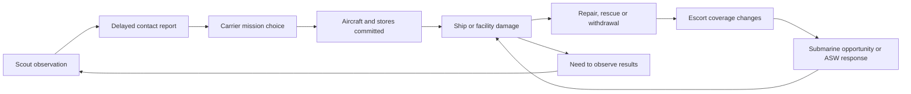

# PRD-midway-asset-battle-integration — A fleet with jobs to do

**Status:** PROPOSED
**Complexity:** 7 (HIGH); risk override: none.
**Owner:** Midway game implementation lane.
**Depends on:** Current sortie/recovery behavior; asset corrections in Phase 1.
**Progress:** Planning complete; implementation 0/5 phases.
**Platforms:** WebGPU web acceptance. Desktop/Android/iOS remain unverified unless their target playtests run.
**Estimate:** 90–140 engineering hours, including asset preparation, AI tuning and playthroughs. Significant remodelling can exceed this estimate; reassess after Phase 1.

Planning only. No game source or supplied assets were changed. Use this repository's existing `docs/PRDs/` convention and keep acceptance here; no parallel task ledger. Complexity comprises 11+ implementation files (+3), new naval/intelligence behavior (+2), and interacting operational state (+2). No engine package release is currently assumed.

## Outcome and decisions to review

**Every supplied asset must earn its place through a battle capability the player can observe and affect.** A model substitution alone does not complete integration. Historical roles constrain equipment and decisions; the simulation must allow different targets, survivors, attack timing and outcomes.

| Decision | Proposed behavior | Alternative and consequence |
|---|---|---|
| Player role | Keep the U.S. pilot experience. Make the already-selectable TBD use its own exterior, cockpit sightlines and working parts; Kate remains an AI aircraft. | A playable Japanese campaign changes briefing, commands, recovery and victory rules; outside this integration. |
| Realism | Real local dimensions, credible aircraft/weapon performance, finite resources and uncertain information. Keep current flight assists. | A full June 3–7 campaign with historical distances needs different pacing and save/progression design. |
| Battle design | Give groups objectives and units capabilities. Choose actions from observations, readiness and threats. | Replaying named historical incidents would violate the request. A cosmetic swap would leave most assets without useful roles. |
| Historical identity | Correct misleading files before admission. Reuse a class model for sister ships only after checking configuration. | Temporarily retaining existing procedural models is acceptable during development; claiming a wrong imported hull is complete is not. |
| Completion | Deliver all five phases, including scouts, surface groups, submarines, rescue/salvage, island effects and player access. | Phase 2 is a useful intermediate playable build, not completion of this PRD. |

### What the player experiences

1. Choose an assignment and SBD or TBD; deck activity reflects aircraft actually preparing or recovering.
2. Find/report contacts or protect a scout. Reports enable strikes; old reports can lead to an empty patch of sea.
3. Attack a carrier or surface target, escort the wing, or help defend a friendly ship. Opponents react to what they know.
4. Notice consequences: fewer enemy launches, an escort leaving formation, a submarine forced deep, or a damaged carrier reopening for recovery.
5. Return to an available deck. The debrief distinguishes personal results, ordered-wing results and changes elsewhere in the battle.

Keep current keyboard, camera, wing orders, H return guidance and L final assist. Extend existing briefing/map/radio/debrief surfaces, with text as well as color. No strategy screen, direct ship control or new cockpit chores. `R` remains reporting; map target selection and the existing attack order work for newly eligible targets.

## Evidence and scope

Inspected 2026-09-13 at sandbox commit `30c3fd8`, with pre-existing local edits in `index.html`, `src/hud.ts`, `src/scenes/Midway.ts`, `src/sim/battle.ts`, `src/sim/recovery.ts` and `src/style.css`. Those edits belong to the current working state. During planning, the other lane committed the sortie/UI/recovery work as `52b58ea`; final document review used that checkout. Execution must preserve the integrated changes and reconcile with their owning lane.

Read the supplied overview first: `/home/joao/.codex/attachments/304de1e5-e066-4aa8-966b-a343780e3c99/pasted-text-1.txt`. Its historical anecdotes are context, not instructions to script losses. Sources below resolve important detail; wartime reports can contain identification and damage-assessment errors.

Source assets: `/home/joao/Downloads/midway-missing-models`. GLB headers and `node tools/inspect-glb.mjs <files>` establish the inventory below. Private background Blender renders covered all twelve unique models, two views each; inspected `/tmp/midway-asset-plan-previews/sheet-{0,1,2}.png` and the four naval PNG references. These are local inspection aids, not in-game visual acceptance. OpenCode `opencode-go/deepseek-v4.1-flash` completed read-only source exploration; its units and broad claims were checked against the relevant source before inclusion.

### Existing behavior to extend

| Boundary | Current source evidence | Required consequence |
|---|---|---|
| Aircraft selection | `armament.ts:LOADOUTS` already selects TBD; `world.ts:setAirframe` draws a procedural Dauntless for any non-SBD player. AI imports are selected by team/kind. | Select by explicit airframe identity for player, AI, parked aircraft and LOD; do not send a new imported aircraft through `animateDouglas`/`disposeDouglas`. |
| Flight | `flight.ts:AircraftFlight` wraps engine `FlightModel`. AI `tactics.ts:steerAircraft` separately integrates bank, pitch, speed and position. Kate constants currently use span 14.9 m and area 34.6 m². | Use engine flight for AI as well; tactics supplies controls. Correct B5N2 data, with measured calibration, rather than introducing another force model. |
| Carriers | `battle.ts:setupFleet` already creates all seven carriers, Tone/Chikuma, Hammann, Arashi/Nowaki and both submarines. `imported-ships.ts:createIjnCarrier` rescales Akagi for Kaga/Soryu/Hiryu; Yorktown draws Hornet. | Replace named render substitutions; preserve unit identity. Mogami-class support group is genuinely new. |
| Operations | `launch` consumes a generic reserve of 12; `updateShips` chooses types by a modulo sequence; `navigateHome` returns one reserve. Fuel and ordnance do not constrain repeated carrier rearming. | Track recoverable airframes separately from finite stores and preparation work; a recovered plane is not a new plane or free torpedo. |
| Intelligence | `updateIntel` detects by radius and copies exact name, deck health, position and course; `selectNavalTarget` does reject reports older than 240 seconds. Submarine targeting bypasses reports and reads the nearest live enemy carrier directly. | Preserve report ageing; add observer limits, classification uncertainty, delivery delay and submarine perception. Do not describe current targeting as entirely unbounded or wholly omniscient. |
| Navigation/targets | Ships move independently; torpedo evasion exists, formation keeping does not. AI naval targeting, HUD contact selection and sortie hit eligibility favor carriers. Manual weapons can already hit other surface ships. | Wire all target consumers together so escorts/cruisers become deliberate assignments; preserve carrier-strike credit rules. |
| Recovery/geometry | `world.ts:sizeCarrier` mutates sim dimensions during rendering; `length/width` mean launch corridor on the home carrier and damage bounds elsewhere. A global deck height feeds approach and crew placement. | Initialize pure ship dimensions before any render. Separate hull, deck and launch/recovery geometry, including per-carrier deck height. |
| Submarines/island | Submarines surface on a sine timer and fire repeat spreads; no meaningful ASW response. Midway is a location plus rendered facilities. | Add depth, ammunition, observation-driven attacks, escort ASW and useful infrastructure. |
| Presentation/budgets | Ten-detail-aircraft admission with hysteresis, ship LODs, shared GLTF resources, 68 live AI aircraft and 20 ocean wake slots already exist. Hornet parks B-25s. | Keep bounded rendering, correct the Midway deck park, and audit capacities when adding the cruiser group. |

All simulation lengths are metres, time seconds and speeds m/s. Existing torpedo speeds 17.25/21/24 and release maxima 57/88 are **m/s, not knots**. Convert only at the HUD boundary and label units.

## Asset disposition, scale and animation

### Measured inventory

All thirteen GLBs report Tripo as generator, one mesh, one material, three embedded images, zero skins and zero animation clips. Each contains a fused hierarchy, with no separately named propeller, gun, gear or periscope. “No clip” therefore requires geometry preparation, not merely starting an animation. Raw XYZ bounds below are source units **before alignment**; several hulls are diagonal, so bounding-box ratios alone do not establish distortion.

#### Aircraft

| File under source directory | MiB / triangles / SHA-256 prefix | Raw XYZ | Admission work |
|---|---|---|---|
| `aircrafts/Douglas+TBD-1+Devastator.glb` | 59.83 / 1,915,063 / `5a34e311560b` | .75 × .27 × .98 | High-detail source only. Separate prop, gear, surfaces, hook and stores; optimize hero/AI versions. Validate the long canopy, wing planform and suspicious perforated trailing-edge treatment against TBD references. It must not inherit Dauntless dive brakes. |
| `aircrafts/Nakajima+B5N2+Kate+Torpedo+Bomber.glb` | 2.45 / 9,793 / `5c9cd0b4b059` | .92 × .37 × .98 | Preserve useful texture detail; correct orientation and proportion if necessary. Separate prop, inward-retracting mains, hook, flaps, rear-gun mount and stores. No need to decimate an already small mesh automatically. |

TBD target: **15.24 m span, 10.67 m length**, from the [USS Midway Museum aircraft entry](https://www.midway.org/visit/aircraft-gallery/tbd-devastator) and [NHHC aircraft specifications](https://www.history.navy.mil/content/dam/nhhc/research/histories/naval-aviation/dictionary-of-american-naval-aviation-squadrons-volume-1/pdfs/app1-3.pdf). B5N2 target: **15.5 m span, 10.3 m length, 37.7 m² wing area**; the [Pearl Harbor Aviation Museum](https://www.pearlharboraviationmuseum.org/news/blog-archives/nakajima-b5n2-kate-type-97-3-carrier-attack-aircraft-at-pearl-harbor/) also distinguishes its torpedo and level-bombing roles. Treat empty mass, usable fuel and engine power as separate quantities; loaded weight cannot be used as empty mass and then receive stores again. Derive guns by airframe/configuration too: Kate has a rear defensive gun, not the generic forward Japanese gun; a player TBD must not inherit the SBD’s gun battery by default.

#### Carriers

| File | MiB / triangles / SHA prefix | Raw XYZ | Admission work |
|---|---|---|---|
| `carriers/uss-yorktown.glb` | 60.70 / 1,875,769 / `dd1db981ea47` | .25 × .39 × .98 | Optimize; check CV-5 configuration, island, deck markings, clear landing corridor and rigging height. Own model for Yorktown only. |
| `carriers/japan-kaga.glb` | 3.42 / 45,683 / `f8157c4b810f` | .55 × .53 × .98 | Align hull before measuring. Check starboard island and Kaga's hull/funnel/deck arrangement; replace its Akagi copy. |
| `carriers/japan-soryu.glb` | 3.10 / 23,605 / `d34168769819` | .49 × .52 × .98 | Check starboard island and Sōryū silhouette; cannot inherit Kaga's proportions just because both have a starboard island. |
| `carriers/japan-kyriu.glb` | 3.34 / 23,421 / `1520303a2c04` | .21 × .35 × .98 | Interpret filename as a **Hiryū candidate**, not proof. Verify port island, funnel side and flight deck, then import as `hiryu`. |

Initial Japanese length references already used in `IJN_CARRIERS`: Kaga 247.65 m, Sōryū 227.5 m, Hiryū 227.4 m. Reconcile with dated drawings before baking, especially hull beam versus flight-deck width. For Yorktown, [DANFS](https://www.history.navy.mil/research/histories/ship-histories/danfs/y/yorktown-iii.html) lists a 809 ft 6 in length (246.74 m); do not automatically equate that hull figure with the overall flight-deck envelope or copy the existing 251.58 m sister-ship mesh measurement. Record the measurement endpoints used.

#### Surface ships, submarines and weapon

| File | MiB / triangles / SHA prefix | Raw XYZ | Admission work |
|---|---|---|---|
| `cruiser/tone-class-cruiser.glb` | 4.01 / 47,991 / `0f57ef7e9740` | .97 × .57 × .98 | Candidate for Tone/Chikuma. Check four main turrets forward and aft aviation area; duplicated file is not proof of two classes. |
| `cruiser/mogami-class-cruiser.glb` | 4.01 / 47,991 / `0f57ef7e9740` | Same | **Byte-identical to Tone file.** One shared source, not a second model. Correct/derive a June 1942 Mogami layout before admission. |
| `destroyers/japan-mikuma-and-mogami.glb` | 3.38 / 22,650 / `882f14114090` | .15 × .33 × .98 | Render looks destroyer-like rather than a validated Mogami cruiser. Compare with the Kagerō PNG and class drawings; possible misplaced Kagerō candidate. Never scale it to cruiser size merely from the name. |
| `destroyers/uss-harmann.glb` | 3.56 / 22,887 / `fc329841741b` | .15 × .38 × .98 | Normalize name to **Hammann, DD-412**, after Sims-class and 1942 armament checks. Use for Hammann; do not silently reskin Phelps/Balch, which are different classes. |
| `submarines/japan-I168-submarine.glb` | 3.28 / 23,243 / `3ed26ed8ee03` | .98 × .55 × .76 | Align diagonal hull; validate I-168 configuration, tower and tube locations. Separate periscope and visible moving parts. |
| `submarines/uss-nautilus.glb` | 3.44 / 22,967 / `f39a975336cf` | .13 × .34 × .98 | Validate **SS-168**, not nuclear SSN-571; check Narwhal-class hull and two large deck guns. |
| `destroyers/torpedo+3d+model.glb` | 2.78 / 24,856 / `7fc4cc6127f4` | .99 × .15 × .15 | Generic long torpedo candidate, nose along a different axis from the game. Identify/correct body diameter, length, tail and screws for each admitted variant; not a universal scale-only Mark 13/Type 91/naval torpedo. |

Hammann reference: **106.17 m length, 11.00 m beam** from [DANFS](https://www.history.navy.mil/content/history/nhhc/research/histories/ship-histories/danfs/h/hammann-i.html). Nautilus: **113.08 m length, 10.13 m beam**, with separate surface/submerged speeds, from [DANFS SS-168](https://www.history.navy.mil/content/history/nhhc/research/histories/ship-histories/danfs/n/nautilus-ss-168-iii.html).

For preliminary layout only, reserve roughly 202 m for Tone-class, 201 m for Mogami-class, 119 m for Kagerō-class and 103 m for I-168. These rounded planning allowances are **not verified conversion constants**. Phase 1 must replace them with dated class measurements and hull/waterline/deck endpoints before import. Weapon variant dimensions likewise require identification before conversion.

All eight supplied PNGs are references, not extra game entities: the two aircraft images, `torpedo.png`, Kagerō, Mikuma and `uss-harman.png` images, and the two cruiser images. Their class labels are not authoritative: the cruiser references also show potentially misleading turret/aviation arrangements. Establish the June 1942 ship configuration using historical photographs/drawings, not image similarity alone. No Kagerō-named GLB exists; resolve the destroyer-shaped candidate before commissioning another model.

### Preparation contract

1. Preserve original Downloads files. Record source hash, author/generation provenance and distribution rights in the game's asset credits when importing; a Tripo generator tag does not establish a license. No supplied license document was found. Planning is not blocked by that; public distribution requires recording the actual rights.
2. Work in a private background Blender session. Establish bow/nose, centreline, waterline/gear contacts and correct upright axes. Bake to metres, +Y up and forward −Z. Apply **uniform** scale after alignment; use localized geometry repair where proportions are wrong. Do not hide errors by independently stretching X/Y/Z.
3. Keep numeric model dimensions and attachment points in a small game-owned `src/sim/catalog.ts`, initialized before `Battle.setupFleet`; render code consumes them. Separate `hullLength/hullBeam`, deck outline/height and launch/recovery corridor. Weapons collide with the relevant hull/deck zones regardless of camera or LOD.
4. Preserve textures/UVs while separating rigid moving pieces. Use ordinary pivot Groups and existing animation conventions; skeletons only for deforming crew. Export with `--vertex-layout separate`. Reject missing required pivots, detached blades, seams, warped gun barrels, invented hull parts and texture loss.
5. Produce close and distant representations with matching identity, size and waterline. Initial ceilings: TBD hero 120k triangles, TBD/Kate AI 25k, Yorktown 200k, other new carriers 60k, cruiser 50k, destroyer/sub 30k, torpedo 3k; far ships 3k and far aircraft 1.5k. These are planning budgets, not measured performance or permission to lose silhouettes. Share materials/textures, load via `ctx.assets`, and dispose instance-owned additions only.

A rejected source still has an explicit destination: correct its geometry from that source and references, or replace it with a verified class model during Phase 1. The duplicate cruiser may become the source for a genuine second class, not a redundant draw. Do not reduce final scope by leaving Mogami/Kagerō identity unresolved.

### What must move

| Subject | Required state-driven motion | Useful check |
|---|---|---|
| TBD/Kate propulsion | Isolate blades/hub, pivot on shaft. Smooth normalized engine RPM, low-speed blades and high-speed blur; engine damage/cut changes spin and sound. | Nose stays still; blades rotate about the shaft. Pause freezes them; two instances at different RPM do not share transforms. |
| Aircraft flight/deck | Gear, wheel rotation, hook, flaps, ailerons, elevator, rudder and rear-gun traverse. Wing folding only while stationary with clearance; TBD and Kate folds differ. | Full deployment range clears fuselage/deck; no SBD dive-brake animation on either torpedo bomber. Flight controls and damage affect visible surfaces. |
| Stores | Separate carried torpedo/bombs and racks. Release removes the actual carried object, reduces payload, then creates one free weapon at its attachment transform. | No baked torpedo remains under an empty aircraft; no double store from `buildAircraft` adding its procedural torpedo. |
| Ships | AA traverse/elevation follows directors; muzzle origin follows mounts. Elevator and parked aircraft reflect flight operations. Flags/wakes reflect wind/speed; damage drives list, smoke and sinking. | No timer-driven elevator through parked planes, infinite deck park or wake on a stationary/deep submarine. Large surface guns do not track fighters as AA. |
| Scouts/submarines/salvage | Catapult launch, floatplane water pickup/crane, periscope extension and diving; survivor boats and alongside hoses appear only during actual rescue/salvage. | Scout cannot launch again while still airborne; deep boat has no visible surface hull/periscope; salvage connections detach before ships separate. |

Borrow the existing Douglas prop-blur approach, without forcing every airframe into its exact clip set. Missing cockpit internals require a simple type-correct cockpit/canopy arrangement for the player TBD; the SBD's instruments, dive-brake panel and sightlines must not masquerade as a TBD cockpit. Shared gauges may be reused where appropriate. Underwater screws need animation only when exposed to the camera; no new underwater cinematic system.

## Battle roles and agendas

Historical anchor: [NHHC's Midway account](https://www.history.navy.mil/browse-by-topic/wars-conflicts-and-operations/world-war-ii/1942/midway.html) establishes the carrier battle, subsequent cruiser pursuit and submarine threat to salvage. The following priorities are **game design derived from those roles**, not a transcript of historical orders.

### Air war

| Unit | Assignment and decisions | How it changes the battle |
|---|---|---|
| TBD Devastator | U.S. carrier torpedo attack. Assemble with escort, use a fresh contact estimate, approach low, choose a legal release solution, release once, evade and return/divert. Abort an unusable approach or inadequate fuel. | Coordinated attacks split defensive attention and threaten flooding/propulsion. Unescorted attacks are vulnerable because of geometry/performance, never a scripted casualty multiplier. |
| B5N2 Kate | Japanese torpedo or **level-bombing** loadout chosen before launch. Island targets call for bombs; identified ships can justify torpedoes after a real rearm delay. Do not fly Val-style dive attacks. | Creates low-level carrier threats or damages island facilities; resource and contact changes alter which mission is launched. |
| Existing SBD/Val | Retain dive-bombing roles and give their waves actual aircraft/stores/escort availability. | A low defensive CAP can create a high approach opportunity; no “torpedo wave arrived → carriers automatically vulnerable” rule. |
| Existing Wildcat/Zero | Local CAP versus escort commitment, altitude coverage, fuel/ammo and return decision. Sections may cooperate; escorts stay with their assigned strike unless a local threat or order justifies separation. | More escort protection means fewer fighters at home. CAP pursues sensed threats, not every enemy's exact position. |
| PBY and new cruiser floatplane | Finite scouts, assigned search sectors, reports, fuel reserve and recovery. Add a recognizable procedural Japanese floatplane if no validated model exists; do not call a carrier-launched Val a Tone scout. | Detection creates a targeting opportunity; interception creates a search gap. No killed scout emits future reports. |

No new premium models are necessary for Val/Wildcat/PBY just to finish this asset integration; keep their existing honest procedural identities. A6M3 currently substitutes for Midway's A6M2: disclose it in the asset description and avoid calling the whole roster visually exact. Correcting that existing variant is a separate asset task unless the new airframe checks expose a directly affected incompatibility.

### Carrier groups

All carriers can launch, recover, fight fires, maneuver and become disabled or sunk. Differentiate by available air group, deck, damage state and location; names do not receive survival or targeting exceptions.

| Asset/group | Agenda | Meaningful player effect |
|---|---|---|
| Enterprise/Hornet | Operate together in the U.S. striking group; choose CAP, launch strike packages, receive returning/diverting aircraft and preserve sea room. | Home operations depend on surviving decks and stores. Replace Hornet's decorative B-25 park with actual carrier aircraft; B-25s are not a Midway carrier strike type. |
| Yorktown with Hammann | Separate U.S. carrier group, mutually supporting the main force. Repair recoverable damage and accept diverted aircraft when capable. | Defending Yorktown preserves another launch/recovery option. If damaged, its salvage is an opportunity; it can survive, sink earlier or never require salvage. |
| Akagi/Kaga | Strike Midway when suppression is still required and no higher-value fresh carrier contact changes priorities. Conserve CAP and avoid launching into unsafe deck conditions. | Kaga adds real sortie capacity; damaging it removes specific ready aircraft/stores or work capacity, not just generic hit points. |
| Sōryū/Hiryū | Same operational rules in the other Japanese carrier division. Any operational carrier with information and resources can lead a follow-up strike. | Hiryū is neither invulnerable nor guaranteed to be last. Sōryū can survive and counterattack instead. |

Carrier cycle: `available → preparing → deck-ready → launching → airborne → recovering → servicing → available`, with loss/diversion branches. Individual aircraft identities move between states; aircraft, crew, fuel and ordnance are conserved. At the 68-aircraft active cap, keep a launch queued without charging resources until launch succeeds. Maintain per-type inventories and one shared flight-deck occupancy schedule, not a universal modulo spawn pattern. Parked visual instances represent those same inventory records; they are not extra flyable aircraft.

Make preparation/recovery times explicit game tuning, preserving their order and cost. Initial preparation/service times are measured in simulated minutes; emergency firefighting can restore limited capability without restoring hull integrity or spent stores. Launching and recovery conflict on a straight deck. Turn into wind only when operational intent and sea room permit; suspend launch/recovery during emergency evasion, heavy list, fire in the corridor or occupancy conflicts. Use the same eligibility values in the HUD and sim.

### Surface groups

| Unit | Agenda and constraints | Consequence |
|---|---|---|
| Tone/Chikuma | Maintain carrier-screen stations, operate cruiser scouts, provide plausible AA and retain contact reports. Scout handling slows/turns the ship and competes with evasive maneuvering. | Attacking aviation facilities reduces future search coverage. Losing one cruiser does not delete reports already transmitted. |
| Mogami/Mikuma; same class for Kumano/Suzuya | Add a **separate supporting cruiser group**, with an approach/hold/withdraw route. Approach bombardment range only under orders and acceptable air threat; otherwise preserve the group. When damaged, slow/withdraw and assign an escort. | Gives recon and subsequent anti-shipping sorties a real target. A damaged cruiser can escape; enemy withdrawal does not teleport it off-map. |
| Kagerō-class candidates, including Arashi/Nowaki | Screen, plane-guard, investigate submarine reports, conduct finite ASW attacks, rescue survivors, then rejoin. | An escort leaving to hunt or rescue opens a real gap. Its return course can be visually followed, without spawning a clue or directing the player to it automatically. |
| Hammann | Screen/plane-guard near Yorktown; rescue viable survivors; provide firefighting/power alongside a crippled friendly carrier when locally safe. | Assistance slows flooding/fire at a cost in escort coverage and maneuverability. Abort alongside operations on a detected torpedo threat. It is not forced to die or to tow an entire carrier. |

Use formation offsets in a moving group frame, attainable speed/turn limits and predicted closest approach for separation. Evasion temporarily outranks station-keeping; the ship rejoins smoothly rather than snapping back. Route around the atoll/reef and leave water for turns. Ships cannot independently overwrite each other's course authority. If collision handling is enabled, damage follows physical proximity and relative motion; **no Mogami–Mikuma collision is required**. Scuttling, if needed for irrecoverable vessels, is a conditional crew/command decision after rescue, not a named-ship trigger.

### Submarines, torpedoes and ASW

| Asset | Agenda | Counterplay |
|---|---|---|
| Nautilus SS-168 | Patrol a plausible Japanese approach, observe at periscope/surface depth, report when radio conditions allow, attempt a reachable intercept, fire finite tubes, evade and withdraw/recharge when necessary. | It can force escorts out of formation or a carrier to turn, even without a hit. It cannot chase a full-speed carrier underwater or always know the carrier's location. |
| I-168 | Patrol the U.S. approach/island area, use delivered contacts to seek opportunities, favor a reachable high-value ship and withdraw under serious ASW threat. | A slowed carrier is attractive but Yorktown is not hardwired. Detection and screening can prevent the attack entirely. |
| Torpedo variants | Mark 13 for TBD, Type 91 for Kate, appropriate submarine/surface types for their launchers. Finite stock, tube/rack origin, running depth, arming distance, speed/range and family-specific reliability. Straight-running after release. | Legal release does not guarantee a hit; target turns and interception geometry matter. No homing, no team-wide shared “torpedo” dimensions and no unlimited submarine spreads. |
| Escort depth charges | Sonar/visual contact estimate → investigation → attack track → finite salvo with preset depth → reassess/search/rejoin. | Lost contact grows uncertain. A depth charge sinks and detonates by depth; damage uses three-dimensional separation, not a surface-circle hit. |

Submarine state adds continuous `depth` (positive downward), depth rate, surfaced/periscope/deep modes, battery/endurance, tubes/reloads and last observations. Surface navigation is faster but visible; submerged movement is quieter/slower and consumes endurance. No periodic sine-wave surfacing. A submarine's own information is separate from fleet radio knowledge: surfacing/transmitting has a cost; underwater messages are not instantaneous omniscient retasks.

Detection must consider observer position, range, line of sight/horizon, depth, daylight/visibility and the noise of a fast escort. Hydrophone contacts can give bearing/uncertainty without exact range or identity. After a contact is lost, search its estimated area; use local sensor facts for attack solutions. Ordinary strafing cannot damage a deeply submerged boat. Surface bombs can affect a shallow submarine only through a deliberately defined underwater blast path; otherwise they miss, rather than silently sharing a ship damage rectangle.

Use actual torpedo run depth and swept hull intersection. A shallow destroyer alongside a carrier must not be automatically hit before every deeper-running torpedo reaches the carrier; nor must the simulation reproduce the historical Hammann/Yorktown hits. Candidate reliability settings are seeded, weapon-specific game approximations with stated provenance, not guaranteed historical failures or falsely precise probabilities.

### Midway and information

The atoll is a functional base with individually hittable facilities. Five small categories suffice: **runway/aircraft service, fuel/ordnance stores, radar, radio, seaplane area**. Reuse the existing garrison/AA/coastal positions where present; add only geometry necessary to communicate these functions. Radar gives air-warning tracks, not enemy ship names/deck health; radio affects report delivery; losing the seaplane area/fuel limits PBY operations. Runway damage affects land-based aircraft, not every seaplane. Fuel fires can spread locally; one disabled radar does not magically close the whole base. Repair consumes work/time and can be interrupted.

Japanese commanders evaluate reported suppression results to decide whether another island strike is worthwhile. No 06:30 scripted raid or compulsory “second strike required” message. Coastal guns affect ships that actually enter their arcs/range; they do not create a battleship duel elsewhere. An invasion/infantry campaign is outside scope.

Use HYPO intelligence as the rationale for the U.S. starting search/ambush area, not exact live targeting. The [NHHC reconnaissance discussion](https://www.history.navy.mil/about-us/leadership/director/directors-corner/h-grams/h-gram-006/h-006-2.html) supports the importance of scouts and information limits. Keep historical order-of-battle numbers distinct from a deliberately smaller playable roster.



This is a causal loop, not a prescribed event order. In particular, destroying one scout must not prevent all other observers from detecting the fleet, and a report transmitted before that scout dies can still arrive.

## Implementation shape and invariants

### Minimal data and ownership

Keep plain game records and explicit functions; no ECS, planner framework, generic mission schema or behavior-tree library.

| Record / owner | Added fields and responsibility |
|---|---|
| `src/sim/catalog.ts` (new) | Small typed definitions for airframe/ship/weapon identity, numeric dimensions, mount/attachment positions, capacities and initial tuning. Constants carry units/source notes. It imports no Three.js and does not create a runtime asset registry. |
| Existing ship/aircraft records, mutated by `Battle` | Explicit `modelId`, `classId`/`airframe`, group/home id, assigned task/target, task start/reason, damage and capabilities. Carrier inventory is per airframe and per store family. Submarine-only fields stay on submarines. |
| Contact records, `src/sim/intel.ts` (new) | Observer id, observed/delivered times, last position/course estimate, classification/confidence, error radius and observed status. Separate each team's records from internal entity truth. Exact damage state is not automatically public. |
| `src/sim/naval.ts` (new) | Group/course decisions, ship station-keeping, patrol/ASW/rescue/salvage transitions and finite naval resources. `Battle` invokes these on its existing fixed step and remains mutation owner. |
| Existing sortie/events | Add explicit surface-strike/support variants and observed results while retaining release-time stamps, `pending` impact confirmation and the single frozen debrief record. Effects/audio consume events; they never cause damage or decide an objective. |

One source of task truth feeds action, map status and radio. Evaluate strategic priorities at a coarse cadence (initially once per simulated second) with commitment/cooldown to prevent indecisive switching; integrate movement/weapons on the existing fixed step. All randomness uses `Battle`'s seeded generator. Pausing, accelerated time and rendering LOD cannot change inventory, decisions or hit outcomes for equivalent simulation inputs.

Priority order: immediate survival/evasion → safe recovery and local defense → existing committed task → new opportunity → patrol/formation. Give tasks a reason such as `low fuel`, `no fresh contact`, `escort requested`, `carrier repair assistance`, or `withdrawal ordered`. Re-evaluate when new information, damage, stock or orders materially changes feasibility. No name-based immunity, automatic attack on Yorktown, compulsory Hiryū final phase, or historical sinking timer.

### Flight and damage integration

Replace AI's force-like integration in `steerAircraft` with a controller producing engine controls for one `AircraftFlight` per airborne aircraft. Reuse tactical state transitions; remove the old velocity/bank integrator after parity checks. Validate loaded TBD takeoff and low-level release before tuning fleet waves. A bomber must lose speed/altitude when power or control authority is lost; don't retain the current universal speed floor. Initialize every field required by engine flight, standardize normalized fuel versus fuel mass, and count stores once. This is the largest tuning risk in the plan.

Per-deck launch uses the installed `FlightModel` environment's `deckHeight` override and `IFlightDeck` dimensions; the local wrapper must supply the selected deck's numeric geometry. Recovery, `finalReady`, touchdown, visuals and deck crew use that same datum/corridor, rather than introducing parallel eligibility checks. Rebinding a deck must preserve aircraft state. If this needs new engine force/contact behavior, stop game-side implementation of that mechanism and use the engine change route below.

AI scout catapult departure and water pickup can be bounded operational transitions with finite positions, time and capacity; airborne motion still uses engine flight. Define a feasible low-speed water-contact envelope, then a short pickup alongside the stopped/slow cruiser. This does not claim a player-flyable seaplane hydrodynamics model. A generic new catapult force or water-flight model, if necessary, belongs in the engine.

Extend existing ship damage from generic hit points into a small set of functional outcomes: hull/flooding, propulsion/steering, fire, aviation/deck, weapons/sensors. Use class-specific capacity and damaged components; do not copy carrier deck damage/reserve logic onto every hull. Cosmetic gun count must not grant weapons the real ship lacked. Deliberate simplicity: a few functional zones and flooding/fire rates, not a compartment-by-compartment naval engineering simulator.

### Player access and end conditions

Keep at most five briefing categories: existing **Carrier strike**, **Scout and report**, **Open Pacific**, plus **Surface strike** and **Fleet support**. Surface strike designates a known cruiser/destroyer or surfaced submarine. Fleet support offers one currently feasible duty—scout protection, air defense, submarine contact report or rescue-area cover—from the same battle records. A player pilot reports/defends; the destroyer performs sonar/depth-charge/salvage work. No magic aircraft sonar or automatic deep-sub kill assignment.

Each new assignment has a bounded observable completion rule and return requirement: surface strike needs a confirmed qualifying hit on its designated eligible hull; support needs its named event (scout report delivered, friendly recovery completed under cover, or reported contact received by the tasked escort) and the player's recorded participation. Merely waiting near an autonomous success does not earn attack credit. Unavailable/dead targets cause an explicit unavailable/retask result, not invisible mission replacement. Map selection, cycling, wing command, tactical target validation and debrief eligibility all use the same target kind/id contract. Carrier strike remains carrier-only.

Open Pacific may continue through withdrawal and rescue, rather than freezing the world the instant the fourth deck is disabled. Operational success requires the enemy carrier offensive to be ended (no launch-capable deck, or observed withdrawal beyond the declared operational boundary), current incoming threats resolved, a usable friendly recovery deck and Midway's aviation capability preserved. Recover to conclude. A pending salvage/pursuit opportunity remains selectable before choosing to conclude; it is not compulsory to sink every escort. Player loss/all friendly carriers sunk remain defeat. Loss of base aviation makes this operation unsuccessful, while an independently completed short assignment still reports its own result honestly. Enemy withdrawal is inferred from delivered observation, not hidden world state.

The existing tactical map is geographically compressed. Retain real metre-scale hulls, release distances and local motion; label the scenario's reduced separation and turnaround timing as game approximations. Use existing safe time acceleration for travel, advancing the same fixed simulation; never accelerate an individual ship to make a historical appointment. New groups start in plausible sectors rather than spawning behind the player after a named loss. No persistent multi-day campaign, new art for every Tier-B aircraft, full naval bridge simulation, or mandatory historical casualty ratio.

## Capability decisions made before design

Ran the full mechanically explicit request search, then twelve mechanic searches through `engine_search_capabilities`; inspected details for the symbols below. Semantic search suggestions are not all valid matches: the returned `matchedSituation` determines relevance.

| Mechanic | Discovery decision and constraint |
|---|---|
| Static GLB loading/optimization | `createAssetLoader` → reuse scene `ctx.assets`; do not add caches. `modelPass` → installed `@threenative/assets` model optimization with geometry/animation/texture verification. Existing glTF-Transform/Blender preparation is available. |
| Flight and carrier departure | `FlightModel` under `@threenative/core` is the relevant result behind the `aerodynamicCoefficients` search hit. Game supplies airframes, wind, stores/damage modifiers and deck data. |
| Propellers/control surfaces/turrets | No suitable rigid-part animation capability: `SkeletalMesh3D` matched character animation, not these fused static aircraft. Use separated Three.js Groups in `src/render/`; preserve `SkeletalMesh3D` for existing crew and skeleton-safe cloning. |
| Aircraft agendas; naval formation/rescue; sub patrol/sonar; underwater weapons; carrier resources; destructible base | No matching game-behavior capability. Search returned `none` for aircraft agendas/submarine/underwater weapons; buoyancy, flight and terrain suggestions do not implement the other behaviors. Keep explicit pure game functions. |
| Contact delay and clock | `Scheduler` offers callbacks/tweens, not intelligence rules. Continue existing `Battle.time` and fixed-step pure records; no wall-clock timers in sim, no need for a second scheduler. |
| Ocean/hull presentation | Reuse current analytic `WaveField`, which provides matching CPU/TSL samples. `Buoyancy3D` requires rigid bodies/hull points and is not necessary for the current kinematic fleet. `GPUReadback` is asynchronous and explicitly WebGPU-only; unnecessary when analytic CPU samples already exist. |
| Playtest | Retain installed playtest bridge/runner and capture tools; inspected `playtestDiagnostic`. A diagnostic, existence check or green scene boot alone cannot prove role, appearance or platform support. |

Apply the charter by rule: the engine owns platform seams and flight dynamics; game source owns gameplay and appearance. Do not package naval AI or a WWII scenario system. Any necessary engine fix lands in `packages/`, with a focused failing/passing case, engine `pnpm typecheck && pnpm lint && pnpm test`, capability/template documentation, native proof for a portability mechanism, content-hashed tarball, reinstall and removal of the game workaround. Never patch `node_modules`. That would add an independent release boundary and require updating the estimate/complexity, not quietly expanding Phase 2.

## Integration ledger

| Capability | Reachable consumer / files | Replacement and acceptance |
|---|---|---|
| Correct aircraft and moving parts | Briefing loadout → `Midway.selectLoadout` → `Battle.selectLoadout` → `WorldView.setAirframe/buildAircraft/update`; `imported-aircraft.ts`, `model-damage.ts` | Remove non-SBD player Dauntless fallback, team/kind-only identity assumptions and duplicate torpedo geometry for imported types. AC-1–5. |
| Carrier operation and geometry | `Battle.setupFleet/launch/updateShips` → `tactics.navigateHome`, `recovery.finalReady` → HUD/deck rendering | Replace renderer-written sim bounds, modulo launches and free rearm; keep one recovery gate. AC-6–9. |
| Intelligence and useful targets | Sensor observations → `Battle.updateIntel/recordContact` → `selectNavalTarget`, map/cycle/command → sortie confirmation | Remove submarine direct-world targeting and exact unseen condition propagation; retain release stamps and contact ageing. AC-10–13. |
| Surface/submarine consequences | `Battle.step/updateShips/updateWeapons/damageShip` → `naval.ts`, `gunnery.ts` → ship views/ocean/particles/audio | Replace independent straight-line fleet and sine-sub/repeat-spread branches; reuse gunnery/events where valid. AC-14–18. |
| Player completion and readable state | Briefing/support choice → `sortie.ts`, `Midway.action/command`, `Hud.update/drawMap/updateContactList` → recovery/debrief | Add meaningful non-carrier/support outcomes; remove fourth-deck immediate finality for extended operation. AC-19–24. |

## Acceptance criteria

Unchecked items below are **future implementation acceptance**, not missing planning work. Planning is complete when the documented scope, evidence, dependencies and checks are reviewed; this PRD becomes DONE only after implementation satisfies these criteria.

### Geometry and airframes

- [ ] **AC-1 [local; actor: implementation agent]:** Every GLB inventory row has an explicit corrected/imported/deduplicated disposition and recorded source/rights. Tone and Mogami display genuinely different June 1942 layouts; Kagerō candidate identity is resolved; all supplied roles remain covered. Evidence: pending.
- [ ] **AC-2 [local; actor: implementation agent]:** Imported models use validated reference endpoints; principal length/span and beam are within 2% of adopted reference values, with documented local repair for proportion defects. Gear contact, waterline, deck corridor and weapon collision locations agree within 0.1 m at inspected stations. Visual inspection verifies class silhouette/markings/rigging; a bounding-box pass alone is insufficient. Evidence: pending.
- [ ] **AC-3 [local; actor: implementation agent]:** Choosing TBD from the real briefing produces a TBD in deck, chase and cockpit views. AI TBD/Kate and parked examples use their correct airframes across LOD; no Dauntless fallback or stale animation/disposal dispatch. Evidence: pending.
- [ ] **AC-4 [local; actor: implementation agent]:** Each new aircraft demonstrates startup/cruise/cut prop states, correct gear/hook/surface motion and independent instance state. A real release removes one visible store, creates one weapon and changes payload once. Inspect close captures through the full moving-part range. Evidence: pending.
- [ ] **AC-5 [local; actor: implementation agent]:** Through `Battle.step`, loaded TBD and Kate execute stable engine-driven ingress, legal torpedo release and recovery; Kate also executes level bombing. Power/control damage changes flight, no universal minimum-speed flight survives engine loss, and AI no longer uses the old motion integrator. Evidence: pending.

### Carrier operation

- [ ] **AC-6 [local; actor: implementation agent]:** Pure Battle initialization already has the same hull/deck geometry used after WorldView construction. Player recovery/diversion to Yorktown and another friendly deck agrees with `finalReady`/HUD cues and actual geometry. Evidence: pending.
- [ ] **AC-7 [local; actor: implementation agent]:** Launch/recover/service cycles conserve airframe identities, reduce fuel/ordnance, respect deck occupancy and do not spend stores on a blocked launch. Damaged inventory and diversions persist; the visual deck park matches the inventory. Evidence: pending.
- [ ] **AC-8 [local; actor: implementation agent]:** Changing one carrier's ready aircraft, fresh contacts or stores changes its next mission. CAP versus escort commitment is observable; no name-specific counterstrike or modulo-only spawn remains. Evidence: pending.
- [ ] **AC-9 [local; actor: implementation agent]:** Evasion, damaged corridor/heavy list and occupied deck suspend operations with readable reasons; restoring a legitimately repairable condition reopens limited operations without restoring destroyed hull/stores. Evidence: pending.

### Intelligence and base

- [ ] **AC-10 [local; actor: implementation agent]:** An unobserved carrier/submarine never becomes a precise AI target. Detection produces a dated limited report; delayed/lost/stale information changes search behavior. Killing a scout prevents new reports but not a report already transmitted. Evidence: pending.
- [ ] **AC-11 [local; actor: implementation agent]:** Tone/Chikuma actually launch and recover a finite scout, which finds/reports contacts and can be intercepted. Damaging their aviation capability reduces subsequent reconnaissance without erasing received reports. No Val is labelled a cruiser floatplane. Evidence: pending.
- [ ] **AC-12 [local; actor: implementation agent]:** Bombing radar, radio, fuel, runway and seaplane facilities affects their distinct functions. A Japanese follow-up mission responds to observed surviving capability; the attack does not occur solely because a timer/name says so. Evidence: pending.
- [ ] **AC-13 [local; actor: implementation agent]:** Map selection, target cycling, wing orders and new assignment checks agree for an eligible surface ship. Submerged contacts show uncertainty; old carrier-strike/release-stamp/pending-confirmation tests still hold. Evidence: pending.

### Naval roles

- [ ] **AC-14 [local; actor: implementation agent]:** Surface groups keep station through a turn, avoid island/reef and one another, detach on an observed ASW/rescue task and rejoin without teleportation. Removing an escort changes actual protective coverage. Evidence: pending.
- [ ] **AC-15 [local; actor: implementation agent]:** The supporting Mogami group has a reachable approach/hold/withdraw route independent of the carrier formation. Its damage changes speed, support and escape opportunity; a player can report/designate/attack it. No forced collision/sinking. Evidence: pending.
- [ ] **AC-16 [local; actor: implementation agent]:** Both submarines patrol and form observed intercepts, respect surfaced/submerged speed/endurance, expend finite tubes/reloads and evade ASW. A fresh-start seeded run can prevent I-168's attack by detection; no obligatory Yorktown target. Evidence: pending.
- [ ] **AC-17 [local; actor: implementation agent]:** Relevant torpedo variants use correct distinct geometry/origin/envelope/depth/arming behavior, moving-hull swept hits and finite range; escorts attack uncertain submarine contacts with sinking, depth-fuzed charges. Too-deep/too-distant targets survive a miss, while a valid close charge damages one. Evidence: pending.
- [ ] **AC-18 [local; actor: implementation agent]:** Hammann executes rescue and conditionally goes alongside a damaged carrier, providing a measurable repair benefit while relinquishing its screen station. Threat/damage cancels assistance; the same scenario with effective defense allows the carrier to survive. Evidence: pending.

### Player experience

- [ ] **AC-19 [local; actor: implementation agent]:** Carrier/recon assignments remain finishable; new surface-strike and support assignments are reachable from briefing/map, show next action, require participation/observed result, and freeze one honest recovered debrief. Death/unavailable target/restart cannot duplicate completion. Evidence: pending.
- [ ] **AC-20 [local; actor: implementation agent]:** Open Pacific can continue through withdrawal/salvage opportunities; successful conclusion and base/fleet failure follow the declared conditions. A fourth disabled deck does not silently stop an ongoing attack or rescue. Evidence: pending.
### Combined battle proof

- [ ] **AC-21 [local; actor: implementation agent]:** Across seeds 19420604–19420608, normal Battle entry and fixed-step simulation expose every required role in at least one run without injecting task transitions. Repeating a seed/input trace repeats state. Paired scout/escort/protection interventions change the corresponding outcome; do not require exact historical losses or generalize five runs into a balance guarantee. Evidence: pending.
- [ ] **AC-22 [local; actor: implementation agent]:** Inspect real WebGPU captures of player TBD, a Kate release, all new hull classes, floatplane cycle, ASW and salvage at engagement and close ranges. Textures, shadows, LOD, wake slots, weapon mounts and audiovisual cues agree with simulation. No blank/missing frame counts as evidence. Evidence: pending.
- [ ] **AC-23 [local; actor: implementation agent]:** At 1920×1080 on the same named non-software adapter as baseline, after warm-up, a fixed 60-second crowded battle sample meets GPU p95 ≤16.7 ms and Battle fixed-step CPU p95 ≤4 ms at the supported active population, with no >10% regression against the matched baseline. Instrument fixed-step CPU duration in the capture harness; do not call requestAnimationFrame wall intervals CPU time. Record wall-frame p95 separately (virtual-display timing is not physical presentation proof), triangles/draw calls/memory and active counts; no layers disabled. A failing absolute target remains an explicit performance gap, not a pass from the relative comparison. Evidence: pending.
- [ ] **AC-24 [local; actor: implementation agent]:** Required type/build and affected existing simulation/browser checks pass on the integrated candidate; repeated restart/LOD churn has no runtime diagnostics or destroyed shared resources. Web qualification is explicit; any new engine portability mechanism has its required native proof before adoption. Evidence: pending.

## Execution phases

### Phase 1 — Correct, measurable source assets (18–30 hours)

**Status:** NOT STARTED
**ACs:** AC-1–2; prepare AC-4/22/23.
**Files:** `tools/blender/` conversion source, existing GLB checks, `public/assets/` derivatives, new `src/sim/catalog.ts`, asset credits.

Resolve duplicate/mislabeled cruisers and the Kagerō candidate first. Adopt documented dimensions and June 1942 configurations. Split aircraft/ship motion pivots, clear baked ordnance/aircraft where operations own them, produce LODs and retain provenance. Keep the rest of the fleet loaded from existing assets while a corrected individual asset is being prepared; no silent permanent fallback.

**Verification E1:** Extend `node scripts/check-aircraft.mjs`, `node tools/check-fleet.mjs` and `node tools/check-carrier-assets.mjs` to parse actual prepared models, required pivots, dimensions, shared resource contracts and budgets. Use `node tools/probe-glb.mjs <file>` and private Blender orthographic views for unresolved measurements. Inspect geometry/texture appearance; no full-game gate is needed for a source-only intermediate step.
**Checkpoint:** pending.

### Phase 2 — Flyable aircraft and working carrier decks (24–36 hours)

**Status:** NOT STARTED
**ACs:** AC-3–9.
**Files:** `flight.ts`, `armament.ts`, `battle.ts`, `tactics.ts`, `recovery.ts`; existing imported render loaders, `world.ts`, `model-damage.ts`, relevant HUD/camera wiring.

Adopt explicit airframe/model identity and one animation/disposal path per family. Correct player TBD cockpit/exterior and Kate performance/loadouts. Move AI onto engine flight with existing tactical decisions. Initialize pure hull/deck geometry and use it for recovery/collision/render placement. Introduce finite per-type carrier cycles and an honest deck park; remove B-25 parking. This is one integration slice despite crossing more than five files.

**Verification E2:** Extend existing `scripts/check-flight.mjs`, `scripts/check-weapons.mjs` and `scripts/check-loops.mjs` through real Battle calls for AI flight, payload and carrier inventory. Extend `capture-deck.mjs`, `capture-sortie.mjs` and `capture-sortie-runs.mjs` for TBD launch/release/diversion/recovery. Preserve existing sortie completion expectations, including the current twelve-simulated-minute short-run guard; longer new Open Pacific runs have separate limits.
**Checkpoint:** pending.

### Phase 3 — Scouts, surface agendas and useful Midway targets (18–28 hours)

**Status:** NOT STARTED
**ACs:** AC-10–15.
**Files:** new `intel.ts`/`naval.ts`; `battle.ts`, `tactics.ts`, `gunnery.ts`, `sortie.ts`; imported-fleet/world and HUD/scene target wiring.

Implement reports before adding strategic targeting. Add finite cruiser scouts, group station-keeping, the Mogami support group and functional island facilities. Keep surface targeting accessible end to end. Base/scout visuals and notifications consume their operational records.

**Verification E3:** Extend `scripts/check-loops.mjs` for report loss/age/classification, scout inventory and group navigation; extend weapon checks for facility effects. Add one bounded `tools/capture-battle-roles.mjs` for new role flows, using the existing bridge and capture patterns. Injected setup may isolate geometry and difficult branches; it is not evidence that the natural agenda is reachable.
**Checkpoint:** pending.

### Phase 4 — Submarines, ASW and saving a carrier (18–28 hours)

**Status:** NOT STARTED
**ACs:** AC-16–18.
**Files:** `naval.ts`, `battle.ts`, `gunnery.ts`, `armament.ts`; imported-fleet/model-damage/world/ocean; existing event-based audio as needed.

Replace sine surfacing and unlimited direct-world attack loops. Add depth/contact-aware torpedo runs and escort charge attacks. Add survivor/rescue records, alongside assistance and interruption. Fix ocean wake selection/capacity so newly added ships are not silently ignored after slot 20; choose visible active vessels with stable selection rather than array order. Keep deep hulls/wakes hidden appropriately.

**Verification E4:** Extend the same simulation and role-capture checks for tube exhaustion, depth/blast miss/hit, escort diversion, rescue and carrier survival versus loss. Assert damage and inventories through `Battle.step`; capture weapons at their actual mounts and assistance on the actual ship models. Reuse existing weapon/audio event checks for new families rather than building a second event bus.
**Checkpoint:** pending.

### Phase 5 — Assignments, variable outcomes and full battle proof (12–18 hours)

**Status:** NOT STARTED
**ACs:** AC-19–24; integrated acceptance of all prior ACs.
**Files:** `sortie.ts`, `Midway.ts`, `hud.ts`, affected radio/audio text, role captures, existing performance/lifecycle checks and this PRD.

Complete the briefing/map/support/debrief consumer paths, open-operation outcome rules and readable reasons. Run paired interventions and natural seeded scenarios. Reconcile every asset row and integration replacement; remove superseded simulation/rendering branches. Tune only against measured problems. Keep evidence once on the owning AC.

**Verification E5:** `pnpm typecheck`, `pnpm exec vite build`, affected existing flight/aircraft/weapon/loop/fleet/carrier/audio checks, and the required wrapped browser gates below. Inspect images and measure the combined workload before closing. No platform claim comes from a package being installed.
**Checkpoint:** pending.

### Commands, tools and execution constraints

Prerequisites: installed pnpm/Node/esbuild, Blender, glTF-Transform, Playwright Chromium, a working WebGPU hardware adapter, source GLBs, staged package tarballs and rights provenance for distribution. No new external service/authentication is needed for planning or local integration. If replacing a rejected source needs new assets, prefer repairing the supplied model or a small honest procedural model; separately record any source/license requirement.

Use the existing tools, extending only the gaps above. The role capture is a proposed new tool; it does not exist yet. Existing `capture-performance.mjs` defaults to 1672×941 and 20 seconds, so explicitly request 1920×1080 and 60 seconds for AC-23 and extend it to exercise the stated combined workload and assert thresholds; its present median-GPU assertion and wall intervals alone are not the future CPU/p95 gate.

```sh
# Run after implementation, from the game directory, against an isolated served candidate.
MIDWAY_URL=http://127.0.0.1:53XX bash tools/capture-lock.sh node tools/capture-battle-roles.mjs
MIDWAY_URL=http://127.0.0.1:53XX bash tools/capture-lock.sh node tools/capture-sortie-runs.mjs
MIDWAY_URL=http://127.0.0.1:53XX MIDWAY_WIDTH=1920 MIDWAY_HEIGHT=1080 MIDWAY_SAMPLE=60 \
  bash tools/capture-lock.sh node tools/capture-performance.mjs
bash tools/capture-lock.sh node node_modules/@threenative/playtest/dist/runner/cli.js \
  --scenario playtests/launch.playtest.json --url http://127.0.0.1:53XX \
  --browser-recipe webgpu --headed --timeout 45000
```

`53XX` is a deliberately unassigned example port: choose a free concrete port during execution. Also run the affected deck/fleet/sortie/repair/lifecycle captures and the repository-required final handoff gates when their covered behavior changes. All browser launches use `tools/capture-lock.sh`; never `xvfb-run` or a visible desktop. Playtest input uses `holdTicks`/`waitTicks`; setup quaternion plus Space is the reliable aim/fire path.

Use the installed `git-worktree` manager if implementation needs isolation. Resolve the owning sandbox checkout, check-ignore its `.worktrees/<task>/` before creation, reuse the executing task checkout and follow required cleanup on completion. This planning turn created no worktree or browser/dev-server process. No native run, current baseline, gameplay implementation gate or asset license approval is claimed by this document.

## Planning check and next action

The attachment, all thirteen GLBs/eight PNGs, current consumer paths, engine capabilities and primary/museum historical references are accounted for. Source probes and private model renders completed; the duplicate cruiser and class/variant uncertainties are recorded as explicit preparation work. All implementation criteria remain unchecked, with named owners and runnable future proof. No game build or playtest was run merely to validate prose.

Review the five decisions at the top. Approval plus an instruction to implement starts Phase 1; changing the playable side, geographic scale or realism scope should happen before asset/AI work begins.
